# Nama anggota kelompok
1. **MUH NUR REZKI AL'FATIR**
2. **Muh. Ardiansya**

# Menggunakan Google Fonts Online
1. Akses Google Fonts: Buka Google Fonts untuk melihat daftar lengkap font yang tersedia.
2. Pilih Font: Cari dan pilih font yang ingin Anda gunakan. Anda bisa mencari berdasarkan kategori, bahasa, atau popularitas.
3. Tambahkan ke "Selections": Setelah menemukan font yang Anda suka, klik tombol plus (+) untuk menambahkannya ke "Selections". Anda dapat menambahkan beberapa font.
4. Dapatkan Kode Embed:
- Klik pada panel "Selections" (biasanya muncul di bagian bawah halaman).
- Anda akan melihat kode untuk menambahkan font ke dalam proyek web. Salin kode tersebut.
- Tambahkan kode ini ke dalam tag `<head>` pada file HTML Anda.
5. Gunakan dalam CSS: Setelah Anda menambahkan kode ke file HTML, Anda dapat menggunakan font dalam CSS:

# Menggunakan Google Fonts Offline
1. Unduh Font:
- Buka Google Fonts dan pilih font yang ingin Anda unduh.
- Klik tombol "Download family" di bagian kanan atas halaman. Ini akan mengunduh seluruh keluarga font dalam format zip.
2. Ekstrak Font:
- Ekstrak file zip yang diunduh. Anda akan mendapatkan file-font dengan ekstensi seperti .ttf atau .otf.
3. Install Font:
- Untuk Windows: Klik kanan pada file font dan pilih "Install".
- Untuk MacOS: Klik dua kali pada file font, lalu klik "Install Font".
4. Gunakan dalam Program Offline:
- Setelah font terinstal, Anda dapat menggunakannya di program offline seperti Microsoft Word, Adobe Photoshop, atau aplikasi lainnya yang mendukung font.

# Contoh
## Menggunakan Web Font secara Online
1. Buka Google Font
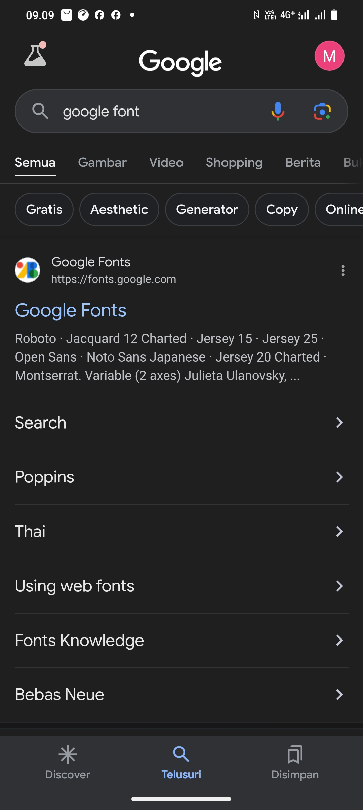
2. Klik font yang di inginkan
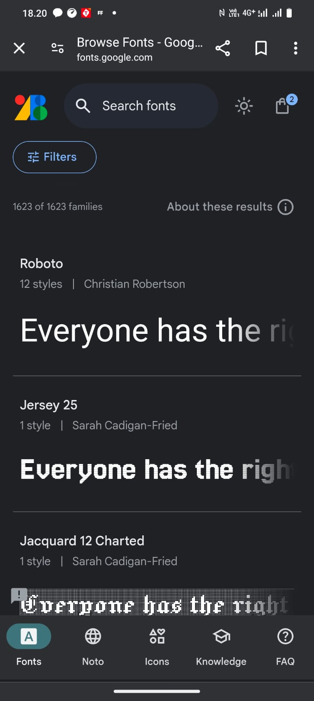
3. Klik Get Font
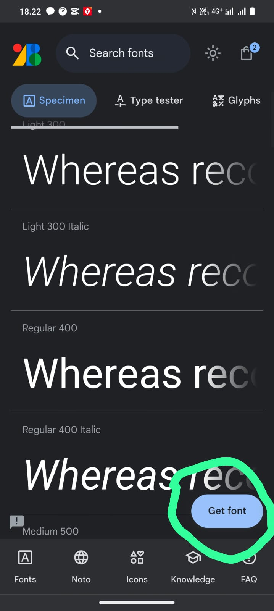
4. Klik Get embed code
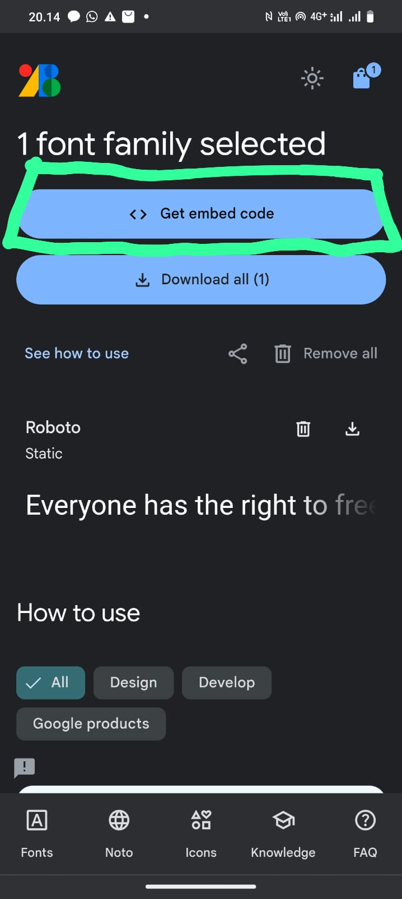
5. Kemudian copy codenya
### Cara pertama menggunakan `<link>`
1 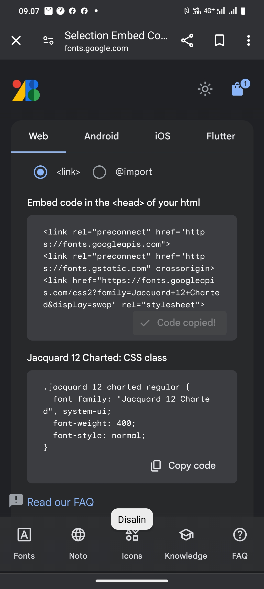
2 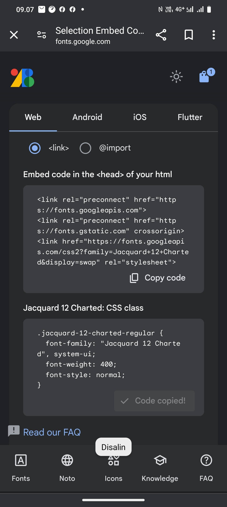
6. Code pertama di kasih masuk di HTML
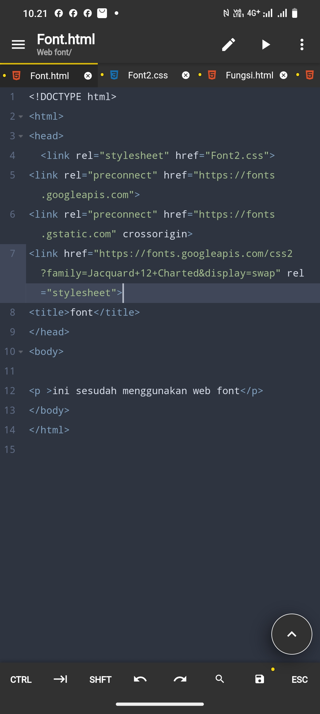
7. Code kedua di kasih masuk di CSS
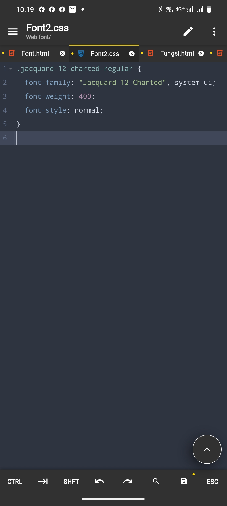
### Cara kedua menggunakan `@import`
1 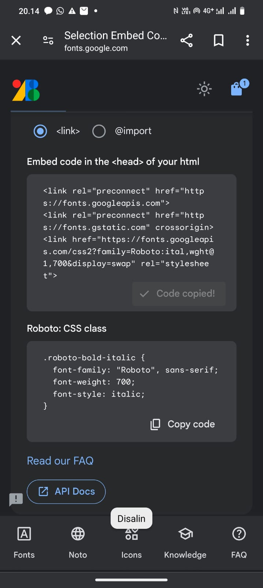
2 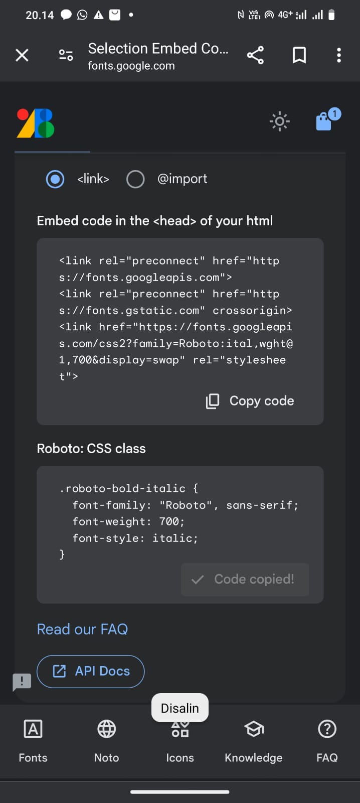
8. Code pertama dan kedua masukan di css
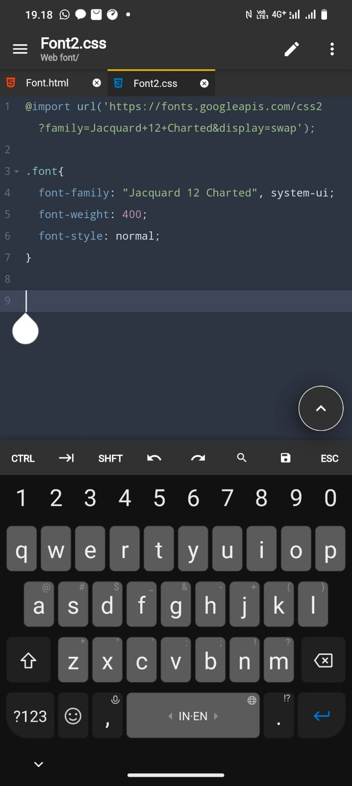
### Hasil
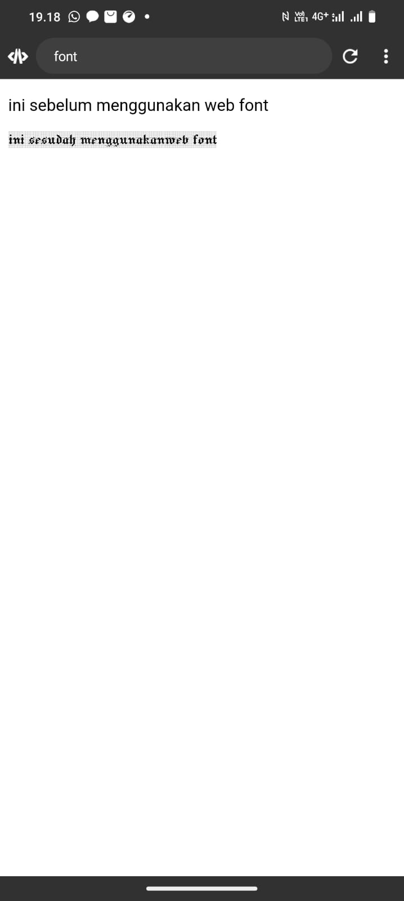


# Menggunakan web font secara offline
1. Buka Google Font

2. Pilih font yang diinginkan

3. Klik get font

4. Klik download
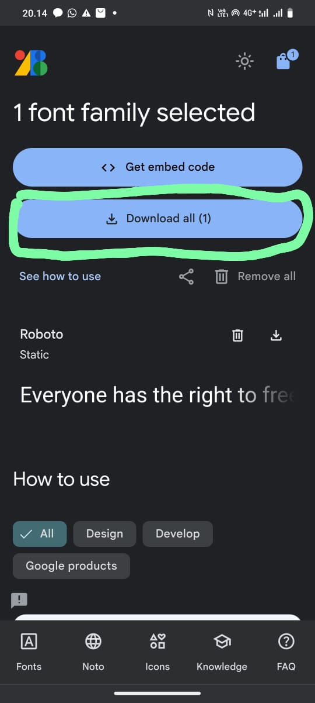
5. Satukan File font dengan file HTML dan CSS
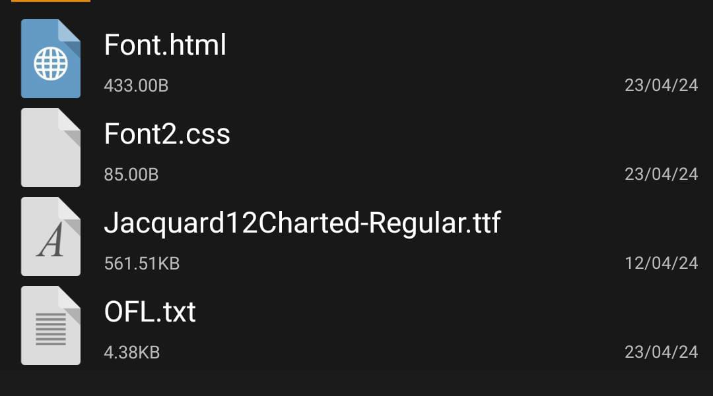
6. Kemudian masukan di css
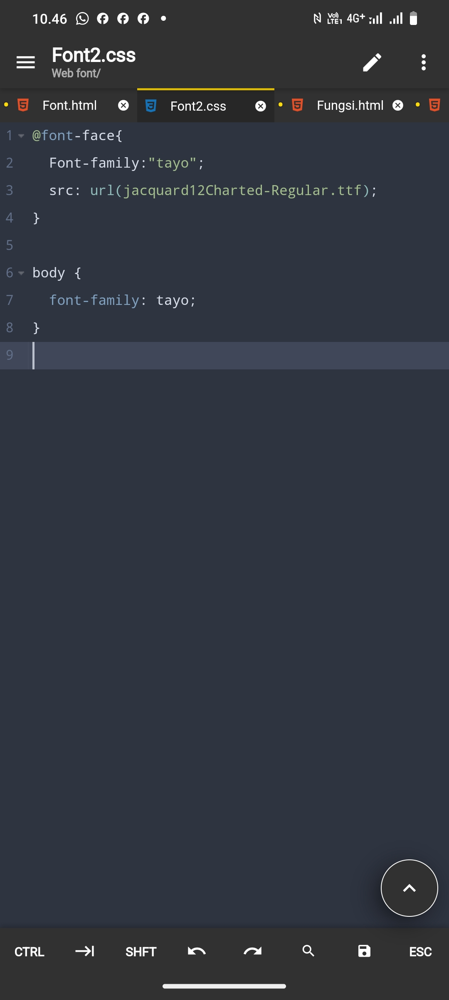
7. Hasil

# Implementasi
## Code
```html
<!DOCTYPE html>
<html>
<head>
    <title>web font</title>
    <style>
        .container {
            display: flex; 
            align-items: center; 
        }
        .image {
            margin-right: 20px; 
        }
        .image img {
            width: 150px;
            height: auto;
        }
         @font-face{
  Font-family:"tayo";
  src: url(jacquard12Charted-Regular.ttf);
}

p {
  font-family: tayo;
}
    </style>
</head>
<body>
    <div class="container">
        <div class="image">
            
        </div>
        <div class="text">
            <h1 class="h">komik</h1>
            <p>Vlad adalah anak gelandangan dari daerah kumuh yang selalu mengagumi kesatria.</p>
        </div>
    </div>
</body>
</html>

```
## Hasil
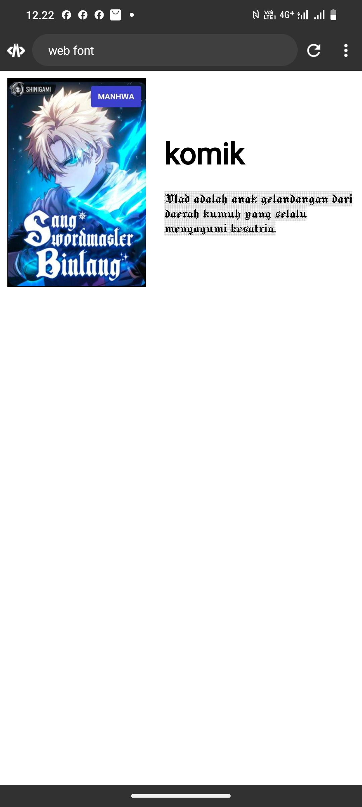
## Penjelasan Program
- Kelas `.containe`r digunakan untuk mengatur tata letak dengan menggunakan Flexbox. Flexbox memberikan cara fleksibel untuk mengatur elemen secara horizontal atau vertikal.` Properti display: flex;` berarti elemen di dalam kontainer ini akan diatur dalam sebuah baris atau kolom.
- Properti `align-items: center; `memastikan elemen dalam Flexbox sejajar secara vertikal di tengah-tengah.
- Kelas `.image` menentukan bahwa gambar dalam kontainer ini memiliki margin kanan `(margin-right) sebesar 20px`. Ini menciptakan jarak antara gambar dan teks.
- Di dalam `.image img`, ukuran gambar ditetapkan dengan `width: 150px;` dan `height: auto;`. Ini memastikan bahwa gambar tetap proporsional.
- deklarasi @font-face, yang mengizinkan penggunaan font khusus pada halaman web.
- Dalam hal ini, font dengan nama `"tayo" `digunakan dan berasal dari file "jacquard12Charted-Regular.ttf".
- Dengan aturan ini, semua elemen `<p>` menggunakan font `"tayo"`.