# Kesimpulan video
## Sejarah web development
Berawal dari tahun 1990-an seorang insinyur yang bernama tim barnes lee yang dimana menciptakan sebuah konsep sistem yang dimana memungkinkan sebuah dokumen dapat terhubung melalui internet, terus juga tim barner lee menciptakan hypertext transfer protokol(http) yang di mana dia menciptakan http sebagai jembatan antara clien dengan server agar bisa saling bertukar data, nah karena teks yang di kirim merupakan teks mentah maka dia menciptakan html sbeagai bahasa untuk markup atau simpel nya ngeformatin teks agar menjadi rapih terstruktur, dan juga tim bernes lee juga lah yang menciptakan pertama kali browser pertama yang di beri world wide web (www) sampai saat ini nama www kita dapat menemukannya wibsite, jadi dia menciptakan http untuk mentransfer data nya, terus dia menciptakan html untuk ngeformatin datanya ,dan dia menciptakan www untuk menampilkan data nya. Jadi jika kita ingin membuat web kita di wajibkan untuk tahu yang namanya html yang dimana html hampir semua website di dunia tanpa terkecuali bahkan youtube menggunakan html sebagai markup languagenya.
# Penjelasan HTML dan CSS
## HTML
html sebagai bahasa untuk simpelnya ngobromatin teks jadi lebih rapi dan lebih terstruktur 
## CSS
kita bisa melakukan stayling setiap tag nya akan tetapi semakin banyak tag dan staylingnya maka semakin berantakan juga code yang dibuat, makanya pada tahun 1994 dibuat lah CSS oleh pak Håkon Wium Lie dengan tujuan agar stayling dengan struktur html nya dapat dipisahkan dan jadi lebih mudah untuk dipelihara sampai saat ini.
# Deskripsi Gambar

## HTML
HTML adalah sebuah kerangka atau pondasi rumah. 
## CSS
CSS adalah sebuah desain pertama yang belum sempurna. 
## JAVASCRIPT
JAVASCRIPT adalah interaksi cerobong mengeluarkan asap ketika memasak, lampu menyala ketika saklar nya di pencet, pintu terbuka dan tertutup. 
# struktur dasar html
```html
<!DOCTYPE html>
<html>
  <head>
    <title>BIODATA SAYA</title>
  </head>
  <body>
    <p>nama saya:fatir</p>
    <p>saya kelas:11 Rpl1</p>
  </body>
</html>
```

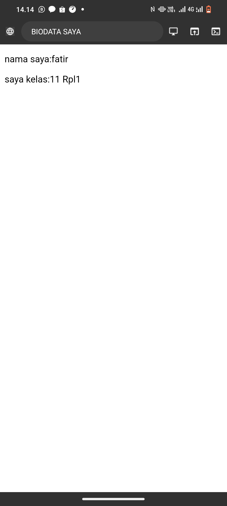
- Tag `<!DOCTYPE html>`memberitahu web browser bahwa dokumen html versi 5
- Tag pembuka `<html>`menandai awal sebuah dokumen HTML sampai dengan tag penutup `</html>
- Tag pembuka `<head>` berisi informasi tentang halaman HTML sampai dengan tag penutup `</head>`, biasanya dalam tag head terdapat tag `<title>` untuk memberikan informasi judul halaman HTML
- Apapun tag yang berada diantara tag pembuka `<body>` sampai dengan tag penutup `</body>` akan tampil di web browser

# Anatomi elemen HTML
```html
<a href="https://www.instagram.com/_f4t1r?igsh=bndvajhwdWpnczA5">ig</a>
```
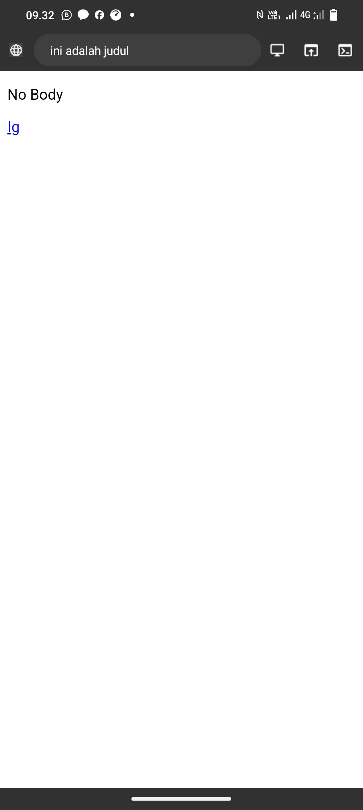
- elemen adalah suatu kesatuan dari sebuah tag yang di mulai dari tag pembuka hingga ke tag penutup elemen HTML secara garis besar terdiri atas tiga bagian yaitu tag pembuka, konten/isi, tag penutup
- tag `<a` adalah elemen dasar untuk membuat link di ==HTML== dan termasuk di tag pembuka
- href="" Adalah nama atribut yang menghubungkan antara halaman web
- https://www.instagram.com/_f4t1r?igsh=bndvajhwdWpnczA5 adalah nilai atribut yang di gunakan untuk mengakses sebuah link
- akun Ig saya adalah isi tag yang terhubung dengan link
-  `</a>` adalah elemen penutup
## Tag Pembuka dan Tag Penutup

Tag pembuka dan tag penutup adalah dua bagian dari suatu elemen dalam HTML yang digunakan untuk menentukan awal dan akhir dari elemen tersebut. Tag pembuka dimulai dengan nama elemen yang diapit oleh tanda kurung sudut ("<" dan ">"). Tag penutup serupa dengan tag pembuka, tetapi memiliki karakter garis miring tambahan ("/") sebelum nama elemennya. contoh ini, `<p>` adalah tag pembuka, dan `</p>` adalah tag penutup
## Atribut Tag
Atribut tag merujuk pada informasi tambahan yang diberikan kepada elemen HTML untuk memberikan rincian atau pengaturan tertentu. Atribut dapat ditambahkan ke sebagian besar tag HTML dan berfungsi untuk mengontrol perilaku atau tampilan elemen tersebut. Contohnya, pada tag `<a>` (hipertaut), atribut `href` digunakan untuk menentukan URL tujuan. Begitu juga, pada tag ``(gambar), atribut src menunjukkan sumber gambar
## Isi/Konten Tag
Isi atau konten tag merujuk pada teks, elemen, atau informasi yang ditempatkan di antara tag pembuka dan tag penutup dalam markup HTML. Contoh sederhana adalah tag paragraf `<p>`, di mana isi tag tersebut adalah teks yang ingin dimuat dalam paragraf. Contoh "Ini adalah contoh isi atau konten dalam tag paragraf." adalah isi atau konten yang akan ditampilkan atau diinterpretasikan oleh browser web ketika halaman HTML di-render
# Tag Dasar
## Heading
```html
<!DOCTYPE html>
<html>
  <head>
    <title>ini adalah judul</title>
  </head>
  
  <body>
    <h1>Senin</h1>
    <h2>Selasa</h2>
    <h3>Rabu</h3>
    <h4>Kamis</h>
    <h5>Jumat</h5>
    <h6>Sabtu</h6>
    <p>Alok</p>
    <p>hi</p>
    <a href="https://www.google.com">Klik Goggle</a>
  </body>
</html>
```
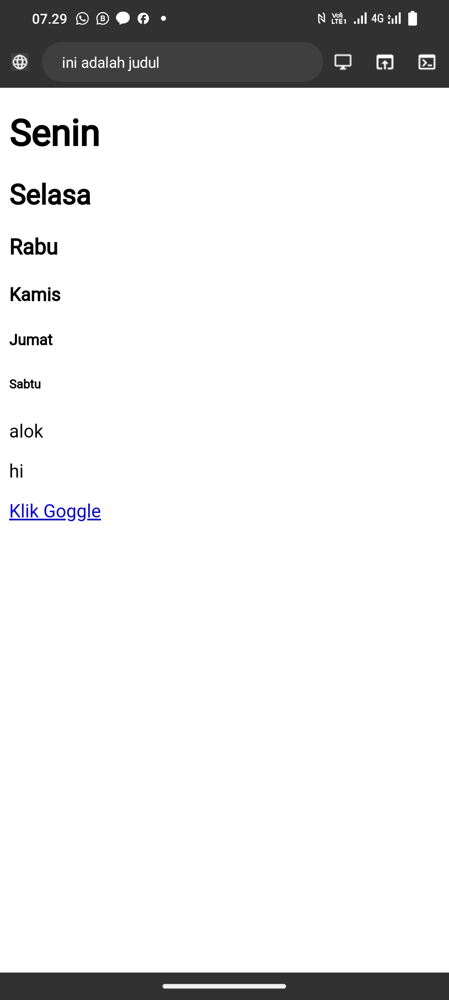
- Tag `<h1>` Digunakan untuk judul 
- Tag `<h2>` Menunjukkan tingkatan judul yang lebih rendah dari `<h1>`
- Tag `<h3>` Menunjukkan tingkatan judul yang lebih rendah dari `<h2>`
- Tag `<h4>` Menunjukkan tingkatan judul yang lebih rendah dari `<h3>`
- Tag `<h5>` Menunjukkan tingkatan judul yang lebih rendah dari `<h4>`
- Tag `<h6>` Menunjukkan tingkatan judul yang lebih rendah dari `<h5>`
## Paragraf
```html
<!DOCTYPE html>
<html>
  <head>
    <title>ini adalah judul</title>
  </head>
  
  <body>
    <p>SAYA</p>
    <br>
    <p><b>kelas saya</b></p>
    <hr>
    <p><u>ALOK</u></p>
    <p><i>tahu</i></p>
    <a href="https://www.google.com">Klik Goggle</a>
  </body>
</html>
```
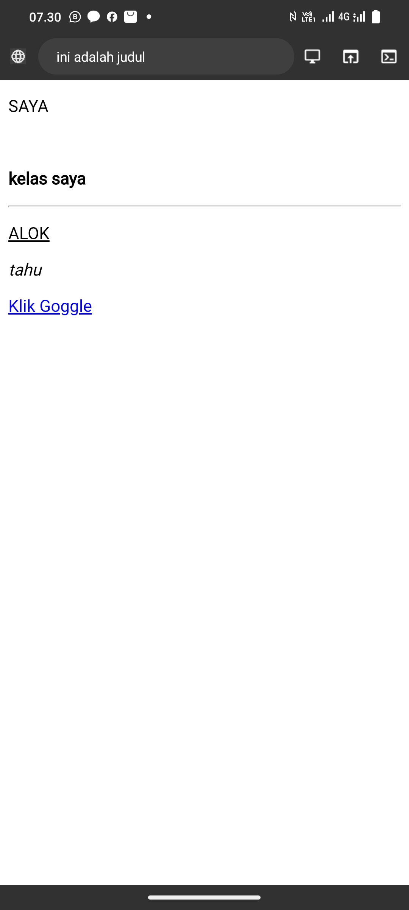
- Tag `<p>`digunakan untuk menandai paragraf pada halaman web dan di akhiri `</p>`.
- Tag `<b>` digunakan untuk membuat teks menjadi tebal (bold) dan di akhiri `</b>`.
- Tag `<u>` digunakan untuk memberi garis bawah pada teks dan di akhiri `</u>`. 
- Tag `<i>` digunakan untuk membuat teks menjadi miring (italic) dan di akhiri `</i>`.
- Tag `<br>` digunakan untuk membuat baris baru. 
- Tag `<hr>` digunakan untuk membuat garis horizontal. 

### Atribut Align
```Html
<!DOCTYPE html>
<html>
  <head>
    <title>TAYO</title>
    </head>
  <body>
    <h3>belajar menggunakan elemen tag</h3>
    <p align="left">saya hari ini ikut apel pagi di sekolah</p>
    <p align="right">saya hari ini belajar elemen tag</p>
    <p align="center">sebentar saya belajar agama</p>
  </body>
</html>
```

- Atribut `align="right"` Teks akan diatur agar terletak di sebelah kanan.
- Atribut `align="center"` Teks akan diatur agar berada di tengah.
- Atribut `align="left"` Teks akan diatur agar berada di sebelah kiri.
## komentar 
HTML Juga mempunyai tag khusus untuk komentar. Untuk membuat komentar di HTML kita menggunakan awalan ``<!--`` dan penutup ``-->``.

Komentar tidak akan di tampilkan pada halaman website namun programmer biasanya menggunakan komentar untuk menjelaskan kode program yang sulit di mengerti
```html
<!DOCTYPE html>
<html>
  <head>
    <title>TAYO</title>
    </head>
  <body>
    <!--ini komentar,tidak akan tampil di browser -->
    <p>ini bukan komentar,dan akan tampil di browser</p>
  </body>
</html>
```
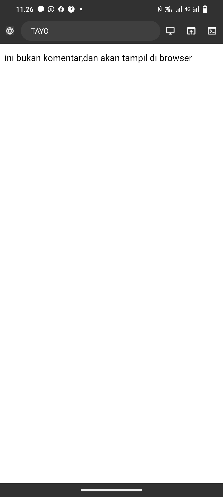

## list 
List adalah fungsi dalam HTML yang digunakan untuk menampilkan daftar, tag list terdiri dari dua jenis ``<ol>`` ordered list (berurutan) dan ``<ul>``unordered list (tidak berurutan). 

Untuk menampilkan list dalam HTML dapat menggunakan tag ``<li>``... ``</li>`` namun perlu dengan menyisipkan elemen ``<ol>``... ``</ol>`` atau ``<ul>``... ``</ul>`` ke dalam elemen ``<li>`` tersebut untuk membuat daftar list. 
```html
<!DOCTYPE html>
<html>
  <head>
    <title>ini adalah judul</title>
  </head>
  <body>
    <ul>List Tidak Berurut
      <li>sapu</li>
      <li>meja</li>
      <li>papan tulis</li>
      <li>kipas</li>
    </ul>
    <ol>List Berurut
      <li>Abd Rahman</li>
      <li>Ahmad Anugrah</li>
      <li>Ahsan</li>
    </ol>
  </body>
</html>
```

## link 
Link dapat ditemukan di hampir semua balaman web. Link/tautan memungkinkan sebuah teks yang ketika di klik akan pindah ke haleman lainnya. HTML menggunakan tag ``<a>``untuk kepeduan ini. Link ditulis dengan ``<a>``yang merupakan singkatan card anchor (jangkar).

==Setiap tag ``<a>``setidaknya memiliki sebuah atribut href Dimana href berisi alamat yang dituju. href adalah singkatan dari hypertext reference.==

Atribut penting lainnya dari tag ``<a>``adalah target. Atribut target menentukan tempat untuk membuka dokumen yang ditautkan. Atribut target, memiliki beberapa nilai salah satunya blank yang berfungsi untuk membuka tautan di tab baru.

Contoh:
```html
<h3>Menggunakan Tag Anchor</h3>

<a href="https://www.google.com" target="_blank">Klik disini untuk ke google</a><br>

<a href="halaman_lain.html">Klik disini untuk ke halaman lain yang saya buati</a>
```


# multimedia
## gambar 
Dalam HTML, gambar didefinisikan dengan tag img) Tag `` terdapat juga atribut width dan height untuk mengatur ukuran gambar, pada versi HTML5 standar satuan ukuran gambar adalah pixel.

- Misalnya dalam folder root terdapat file gambar bernama logo.png. Untuk menampilkan gambar tersebut kita hanya perlu mengisi nama gambar beserta jenis ekstensi file gambar ke dalam atribut src, contohnya src="logo.png"
- Untuk menampilkan gambar dari internet carilah link gambar yang akan ditampilkan lalu masukkan dalam nilai atribut src, contohnya https://namasitus.com/gambar.png.

Contoh
```html
<!DOCTYPE html>
<html>
  <head>
    <title>ini adalah judul</title>
  </head>
  <body>
    
  </body>
</html>

```
Tampilan ke web


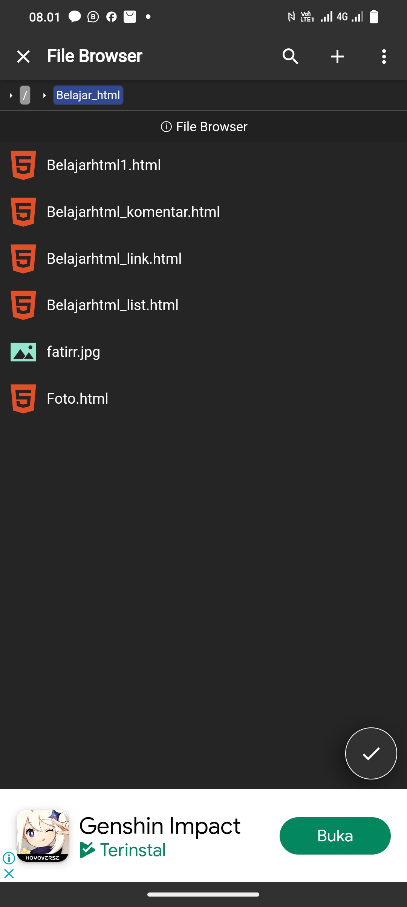

## video
```html
<!DOCTYPE html>
<html>
  <head>
    <title>ini adalah judul</title>
  </head>
  <body>
    <video controls width="250px" height="125px">
      <source src="sukuna.mp4" type="video/mp4">
    </video>
  </body>
</html>
```

Dalam tag `<video>`terdapat juga atribut   `controls` yang digunakan untuk Menambahkan kontrol pemutaran standar seperti play, pause, dan volume, dan juga di tag `<video>` ada atribut `width` dan `height` yang digunakan untuk mengatur ukuran video, pada versi HTML 5 standar satuan ukuran video adalah pixel, dan juga di dalam nya juga terdapat atribut `type` yang di gunakan untuk menentukan tipe MIME (Multipurpose Internet Mail Extensions) dari file video yang disematkan.

dalam HTML, video didefinisikan dengan tag `<video>`, tag `<video>` adalah tag yang digunakan untuk memasukkan video kedalam web, di tag `<video>` terdapat tag khusus yang dimana tag ini tidak memiliki tag penutup yaitu `<source>` yang Digunakan untuk menyediakan beberapa sumber video dan memberi browser pilihan format yang sesuai.

misalnya dalam folder root terdapat file video bernama video.mp4. untuk menampilkan video tersebut kita hanya perlu mengisi nama video beserta jenis ekstensi file video didalam tag `<source>` dan didalamnya atribut `src` terus juga didalam tag `<source>` kita beri juga didalamnya atribut `type` untuk menetukan tipe MIME(Multipurpose Internet Mail Extensions) di file video yang di sematkan.


## audio
```html
<!DOCTYPE html>
<html>
  <head>
    <title>ini adalah judul</title>
  </head>
  <body>
   <audio controls>
     <source src="sukuna.mp3" type="audio/mp3">
   </audio>
  </body>
</html>
```
Di HTML, tag `<audio>` digunakan untuk menyematkan dan memainkan file audio di halaman web. Tag ini memungkinkan pengembang web menyertakan file audio langsung di dalam dokumen HTML, memungkinkan pemutaran langsung di halaman tanpa perlu mengarahkan pengguna ke halaman terpisah atau menggunakan pemutar audio eksternal. di dalam tag `<audio>` juga memiliki atribut yaitu `src` ,  `controls` , `type` yang memiliki fungsi masing masing

- `src` digunakan untuk menentukan URL atau path ke file media yang akan ditampilkan.
- `controls` yang digunakan untuk Menambahkan kontrol pemutaran standar seperti play, pause, dan volume.
- `type` digunakan untuk menentukan tipe MIME (Multipurpose Internet Mail Extensions) dari file audio yang disematkan.
- `<source>` Digunakan untuk menyediakan beberapa sumber audio dan memberi browser pilihan format yang sesuai.

Tampilan ke web

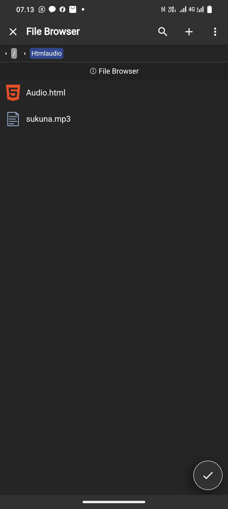

## Halaman web lain
Elemen `<iframe>` dapat digunakan untuk menampilkan dokumen html lain dalam sebuah website. Mudahnya, bsa dibilang website dalam website.

 Contoh penggunaannya seperti ini. jika kita mempunyai website sekolah, lalu di website tersebut ingin menampilkan alamat alamat dalam google maps sekolah. Agar memudahkan pengunjung website, kita bisa langsung tampilkan saja pada halaman sekolah yang ada di google maps agar yang menggunakan web kita mudah mencari nya

Dalam tag `<iframe>` ada beberapa atribut yang penting seperti:

- `src` , untuk mencari sumber halaman html atau web yang akan ditampilkan di dalam frame
-  `width` dan `height` , untuk mengatur ukuran panjang dan lebar dari frame

contoh

```html
<iframe src="https://www.petanikode.com/" width="1300px" height="450px"></iframe>
```

hasil


# Tabel
Tabel dalam HTML di definisikan dengan `<table>`
- Setiap baris tabel didefinisikan dengan tag `<tr>`
- Header (judul) tabel didefinisikan dengan tag `<th>`. secara default, header tabel memiliki teks tebal dan beraada di tengah
- Data tabel/sel didefinisikan dengan tag `<td>` . Karena sel merupakan bagian terkecil dari tabel maka dari itu tag selalu berada di dalam tag `<tr>` .

contoh
```html
<table border="1">
<tr>
  <th>nama</th>
  <th>asal intitusi</th>
  </tr>
  <tr>
  <rd>Fatir<td/>
```


>[!info] kita perlu Perhartikan bahwa pada tag `<table>` terdapat sebuah atribut `border`. Atribut border yang digunakan untuk memberikan nilai garis tepi dati tabel, nilai ini dalam ukuran pixel. `border="1"`, berarti kita mengistruksi kepada web browser bahwa tabel tersebut akan memiliki garis tepi sebesar 1 pixel. Jika tidak ditambahkan, secara default tabel tidak memiliki garis tepi. 

Selainitu, terdapat pula beberapa atribut tabel yang penting untuk diketahui yaitu:

- `rowspan` merupakan atribut HTML yang berfungsi untuk menggabungkan beberapa baris (ke bawah)
  - `colspan` atau colomn spawn merupakan atribut HTML yang berfungsi untuk menggabungkan beberapa kolom (ke samping)
  - `width` berfungsi untuk mengatur lebar tabel yang nilainya didefinisikan dalam satuan pixel secara default.
  - `height` berfungsi untuk mengatur tinggi tabel yang nilainya didefinisikan dalam satuan pixel secara default.
  - `align` berfungsi untuk mengatur perataan teks padatabel. Nilai atribut yang dapat diberikan yaitu `left` untuk perataan teks ke kiri, `right` untuk perataan teks ke kanan, `center` untuk perataan teks ke tengah.
  
## Tabel1
### contoh
```html
<table border="1">
        <tr>
            <th>no</th>
            <th>NAMA</th>
            <th>asal sekolah</th>
            <th>kelas</th>
            <th>kelamin</th>
            <th>umur</th>
        </tr>
  <tr>
            <th>1</th>
            <th>Muh.Nur Resky Alfatir </th>
            <th>smk negeri 7 makassar</th>
            <th>XI RPL 1</th>
            <th>laki-laki</th>
            <th>16</th>
        </tr>
        <tr>
            <td>2</td>
            <td>Muh.Agis </td>
            <td>smk negeri 7 makassar</td>
            <td>XI RPL 1</td>
            <td>laki-laki</td>
            <td>16</td>
        </tr>
        <tr>
            <td>3</td>
            <td>Muh.Daud Resky Jayadi </td>
            <td>smk negeri 7 makassar</td>
            <td>XI RPL 1</td>
            <td>laki-laki</td>
            <td>17</td>
        </tr>
      
    </table>
```
Hasil
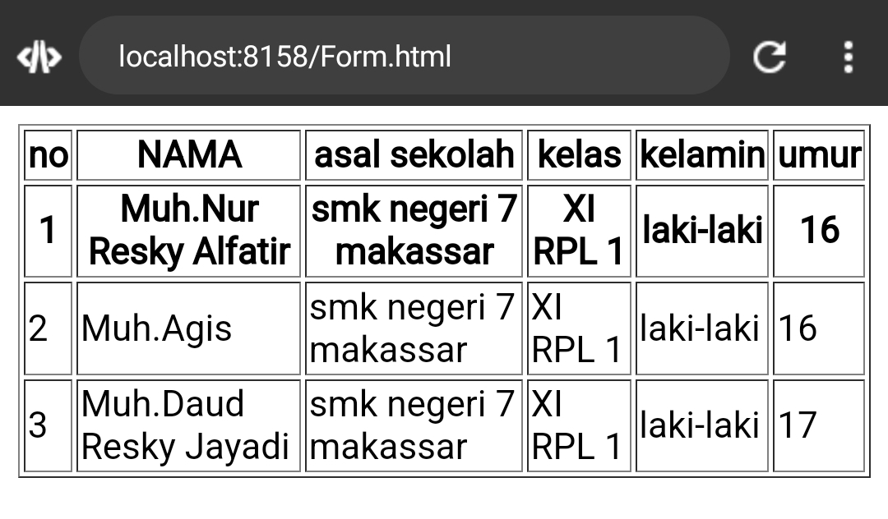

## Table2
### contoh
```html
<!DOCTYPE html>
<html>
  <head>
    <title>Membuat Tabel HTML</title>
  </head>
  <body>
    <table border="1" width="40%">
      <tr>
        <th rowspan="2">Nama</th>
        <th colspan="2">Asal Institusi</th>
      </tr>
      <tr>
        <th width="150">sekolah</th>
        <th width="100">Jurusan</th>
      </tr>
      <tr>
        <td>fatir</td>
        <td>smk7</td>
        <td>rpl</td>
      </tr>
      <tr>
        <td>daud</td>
        <td>smk7</td>
        <td>rpl</td>
      </tr>
      <tr>
        <td>angga</td>
        <td>smk7</td>
        <td>rpl</td>
      </tr> 
      <tr>
        <td>agis</td>
        <td>smk7</td>
        <td>rpl</td>
      </tr>
    </table>
  </body>
  </html>
```

Hasil
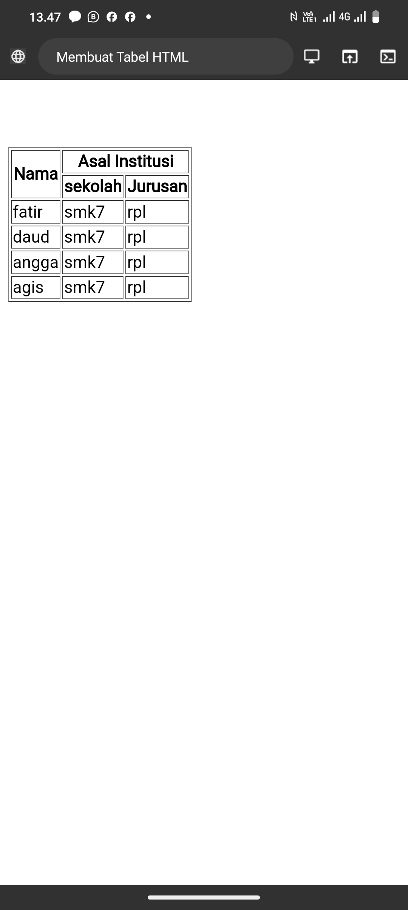

## Tabel3
### Contoh
```html
<!DOCTYPE html>
<html>
  <head>
    <title>Hi</title>
  </head>
  <body>
    <table border="1" width>
      <tr>
        <th colspan="2" bgcolor="green">nama hari</th>
        <th colspan="2" bgcolor="green">nama bulan</th>
       </tr>
       <tr>
        <td align="center" widht="300">senin</td>
        <td >selasa</td>
        <td> mei</td>
        <td rowspan="2">juni</td>
      </tr>
      <tr>
        <td >rabu</td>
        <td>kamis</td>
        <td>april</td>
      </tr>
       
      </tr>
    </table>
  </body>
  </html>
```
Hasil:

# Form

Elemen `<form>` HTML digunakan untuk mendefinisikan _form_ yang digunakan untuk mengumpulkan inputan dari pengguna _website_. Tag ini digunakan untuk mengkoleksi inputan dari user, konsep ini sama seperti konsep formulir di dunia nyata.

>[!info] Dengan kata lain tag `<form>` merepresentasikan sebuah "formulir" di mana satu formulir bisa memiliki banyak kolom isian.
>

Form HTML berisikan elemen-elemen `form` lainnya. Elemen `<form>` digunakan untuk menampung macam-macam elemen yang berkaitan dengan sebuah `form`, seperti `text` `fields`, `checkbox`, `radio button`, tombol `submit`, dan banyak lagi yang dapat diedit kemudian ditulis untuk dikirim pada sebuah _server_ untuk selanjutnya diproses guna mendapatkan informasi tertentu dari atau untuk _user_.
Umumnya, sebuah _website_ selalu memiliki fitur _form_, contoh paling umum yang sering kita temui adalah seperti _form login, form sign up, form_ komentar di suatu _blog/media_.

1.  **Input**
Elemen `<input>` adalah elemen `form` yang paling penting. Elemen `<input>` dapat ditampilkan dalam beberapa cara, tergantung pada nilai atribut `type` yang digunakan. Request Berikut adalah beberapa contoh nilai dari atribut `type` :

- `text` digunakan untuk mengambil isian berupa teks. Contohnya seperti nama.
- `password` digunakan untuk mengambil isian berupa **kata sandi** atau sesuatu yang bersifat rahasia. Tipe ini akan mengubah semua karakter yang diketikkan ke dalam karakter bulat.
- `radio` digunakan sebagai kolom isian bertipe **pilihan** yang menawarkan beberapaopsi kepada user namun tetapi hanya satu opsi saja yang boleh dipilih. Contohnya seperti jenis kelamin atau agama.

>[!info] Perlu diperhatikan bahwa untuk penggunaan tipe `radio` yang berkategori set pilihan yang sama mengharuskan nilai `name` nya juga sama.
Opsi default dapat dilakukan dengan menambahkan atribut checked pada elemen opsi yang dijadikan sebagai opsi default.

- `checkbox` digunakan untuk memberikan *daftar pilihan dalam satu set opsi*. User dapat memilih satu atau bahkan lebih dari satu pilihan pada tipe ini. Hal ini berbeda dengan tipe sebelumnya yaitu `radio` yang hanya memungkinkan user untuk memilih satu  pilihan saja. Contoh penggunaan `checkbox` seperti daftar makanan kesukaan, daftar olahraga yang tidak disukai, dan yang semisalnya.

  >[!info] Perlu diperhatikan bahwa untuk penggunaan tipe `checkbox` yang berkategori set pilihan yang sama mengharuskan nilai `name` -nya juga sama.

- `Number` digunakan untuk membatasi isian user hanya pada karakter numerik saja. Browser akan menambahkan dua buah tombol atas dan bawah untuk mengubah angka isian.

Beberapa atribut untuk tipe number :
- `min` - menentukan angka minimal
- `max` - menentukan angka maksimal
- `step` - menentukan kelipatan (nilai yang tidak sesuai kelipatan tidak bisa di-input, dan default dari atribut ini adalah `1`)

- `Date` digunakan untuk memberikan isian berupa tanggal. Atribut `min` dan `max` dapat pula difungsikan pada tipe ini untuk mengatur tanggal minimal dan tanggal maksimal yang diinginkan.

- `File` digunakan untuk memungkinkan pengguna memuat file. Atribut `accept` juga dapat disisipkan pada tipe ini dengan maksud untuk mengatur file apa saja yang boleh di-upload. Beberapa contoh value dari atribut `accept` yaitu:

- `accept-"image/png,inage/jpg.Image/jpeg` - untuk file gambar seperti `png`, `jpg`, atau `jpeg`
- `accept="pdf"` - untuk file pdf
- `accept-".doc, docx"` - untuk file `doc` atau `docx`
- `accept-".ppt, pptx"` - untuk file `ppt` atau `pptx`

- `submit` ditampilkan dalam bentuk tombol untuk mengirim data pada `<form>` yang menjadi pembungkusnya. Atribut `value` digunakan untuk mengisi teks yang ingin ditampilkan pada tombol.

- `reset` berguna untuk *mengembalikan state (keadaan) atau data dari suatu form ke nilai awalnya*. Jika nilai awal sebuah input adalah kosong, maka ketika direset ia akan kembali kosong. Tapi kalo nilai awalnya sudah terisi , maka ketika direset datanya akan kembali kosong.

- `button` berguna untuk membuat inputan berupa sebuah tombol. Tombol ini nantinya bisa difungsikan sesuai dengan keinginan dari pengembang web.

2. **Label**
Elemen `<label>` memiliki fungsi khusus untuk melabeli sebuah kolom inputan. Ketika screen reader membaca konten halaman HTML, lalu menemukan sebuah inputan, ia akan membaca label yang bersangkutan. 
Fungsi lain dari tag `<label>` adalah ketika kita mengklik label, maka browser akan meletakkan fokus pada kolom isian yang terhubung dengannya. Syarat yang perlu diperhatikan yaitu dengan menghubungkan sebuah `<label>` dan `<input>` dengan atribut `for` untuk `label`, dan atribut `id` pada `<input>` dengan nilai untuk kedua atribut tersebut mesti sama persis.

3. **Select**
Elemen `<select>` berguna dalam mendefinisikan sebuah tombol dropdown yang dimana user dapat memilih salah satu dari banyak pilihan.

 Elemen `<select>` nantinya berperan sebagai kontainer atau pembungkus dari elemen `<option>` yang berperan sebagai daftar pilihan atau opsi. 

 Elemen `<select>` hampir mirip fungsinya dengan `<input type ="radio">` akan tetapi baiknya elemen `<select>` digunakan untuk memilih satu pilihan yang terdapat banyak opsi di dalamnya, sedangkan `<input type ="radio">` lebih baiknya untuk digunakan jika user diarahkan memilih hanya satu pilihan yang opsi pilihannya tidak terlalu banyak. Contoh penggunaan elemen ini seperti memasukkan pilihan berupa asal daerah atau yang semisalnya.
 
Penting untuk diketahui bahwasanya opsi yang aktif secara default adalah adalah opsi yang pertama. Akan tetapi, kita bisa mengatur opsi mana yang aktif secara default dengan menambahkan atribut selected pada suatu `<option>` yang ingin dijadikan sebagai opsi default.

4. **Text Area**
Elemen `<textarea>` berguna untuk mengambil inputan user berupa teks yang dapat memuat lebih dari satu baris. Jika dibandingkan dengan elemen `<input>` teks biasa, elemen `<textarea>` memiliki ukuran tinggi yang lebih besar. Element `<textarea>` bisa diisi lebih dari satu baris dengan menekan enter.

Atribut yang dapat digunakan untuk mengatur kuran dari textarea yaitu rows untuk jumlah baris, sedangkan atribut cols untuk lebarnya.

5. **Button**
Elemen `<button>` yang berada di dalam sebuah `form` akan otomatis dianggap sama fungsinya seperti `<input type="submit">`. Jika ingin membuat tombol biasa yang tidak men-submit `<form>` dapat dilakukan dengan menambahkan atribut `type="button"`.

```HTML
<h1>Formulir Pendaftaran</h1>
<form action="">
    <div>
      <label for="nama-lengkap"><b>Nama Lengkap:</b></label><br>
      <input type="text" id="nama-lengkap" name="nama_lengkap" placeholder="Masukkan nama lengkap" required>
     </div>

     <div>
       <label for="password"><b>Password:</b></label><br>
       <input type="password" id="password" name="password" placeholder="Masukkan password" required>
      </div>

      <div>
        <b>Jenis Kelamin:</b><br>
        <input id="lk" type="radio" name="jenis_kelamin" checked>
        <label for="lk">Laki-Laki</label>

        <input id="pr" type="radio" name="jenis_kelamin">
        <label for="pr">Perempuan</label>
      </div>

      <div>
        <label for="isian-usia"><b>Usia:</b></label><br>
        <input type="number" id="isian-usia" name="usia" min="17" max="25" value="19" required> Tahun
      </div>

      <div>
         <label for="tgl-ijazah"><b>Tanggal Ijazah:</b></label> <br>
         <input type="date" id="tgl-ijazah" name="tgl_ijazah" min="2021-01-01" value="2023-06-20" required>
      </div>

      <div>
         <label for="opsi-agama"><b>Agama:</b></label><br>
         <select id="opsi-agama" name="agama" required>
           <option disabled>---Pilih Agama----</option>
           <option value="islam">Islam</option>
           <option value="kristen">Kristen</option>
           <option value="katolik">Katolik</option>
           <option value="hindu">Hindu</option>
           <option value="buddha">Buddha</option>
           <option value="atheis" disabled>Atheis</option>
          </select>
       </div>

       <div>
          <label for="alamat"><b>Alamat:</b></label> <br>
          <textarea id="alamat" name="alamat" cols="25" rows="5" placeholder="Harap masukkan alamat secara lengkap" required></textarea>
       </div>

       <div>
          <b>Kemampuan Berbahasa Asing:*</b><br>
	        <input type="checkbox" id="inggris" name="bahasa_asing">
	        <label for="inggris">Inggris</label>

          <input type="checkbox" id="arab" name="bahasa_asing">
          <label for="arab">Arab</label>
                
          <input type="checkbox" id="jepang" name="bahasa_asing">
          <label for="jepang">Jepang</label>
       </div>

       <div>
          <label for="isian-foto"><b>Foto 4x6:*</b></label><br>
          <input type="file" id="isian-foto" name="foto" accept="image/png,image/jpg,image/jpeg">
       </div>

       <br>
       <input type="submit" value="Kirim">
       <input type="reset" value="Batal">
       <i>*opsional (tidak wajib diisi)</i>
</form>
```

Hasil:
Ini adalah gambar formulir pendaftaran masuk sekolah
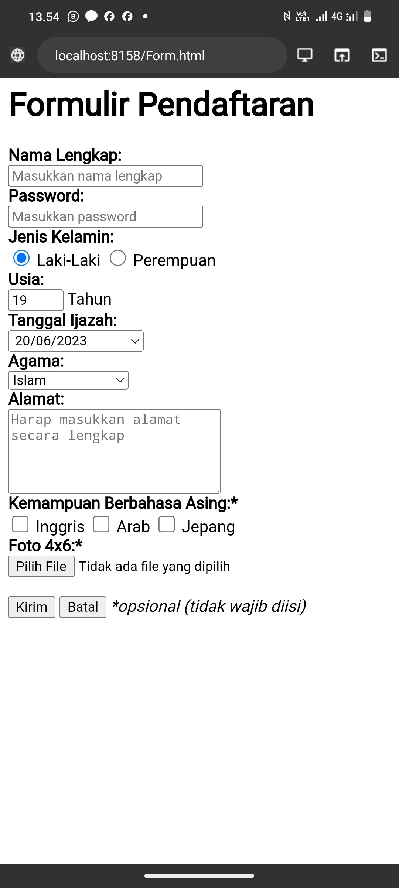

Beberapa atribut yang digunakan pada contoh di atas yang perlu untuk diperjelas yaitu sebagai berikut:
- `name` - digunakan sebagai nama variabel yang akan diproses oleh web server.
- `required` - digunakan untuk memastikan bahwa pengguna harus memasukkan nilai pada input tersebut sebelum dapat melakukan proses submit formulir.
- `placeholder` - menuliskan teks pada elemen input. Placeholder sangat bermanfaat untuk memberikan teks bantuan kepada user untuk inputan _form_ yang kompleks.
- `value` - menentukan nilai awal dari sebuah elemen input.
- `disabled` - digunakan untuk menonaktifkan inputan pada elemen yang diberi atribut ini.

## **Bagaimana Cara Memproses Form?**

Ketika sebuah `<form>` disubmit, baik menggunakan elemen `<button>` mau pun `<input type="submit">`, browser akan mengirimkan data tersebut kepada URL yang didefinisikan pada atribut `action` di dalam tag `form`.

Ada pun jika atribut `action` tidak didefinisikan, maka *browser* akan menggunakan URL sekarang sebagai tujuan pengiriman data.

Contoh:

```html
**<form** action**=**"/proses-pendaftaran"**>**
  ...
**</form>**
```

Pada contoh di atas, ketika form di-*submit*, *browser* akan mengirimkan data yang ada  menuju URL `/proses-pendaftaran`.

**Apa yang terjadi pada URL `/proses-pendaftaran`?**

Pada URL tersebut terdapat sebuah aplikasi/program yang berjalan di *server* (bukan di *browser*). Tugas dari program tersebut adalah mengelola data yang dikirim seperti misalnya menyimpan data tersebut ke dalam sebuah *database*.

Bahasa yang umum digunakan di dalam server adalah python, nodejs, PHP, dan lain sebagainya.

Untuk mendapatkan gambaran lebih jelas, sebenarnya akan dijelaskan pada modul selanjutnya yang berkaitan dengan materi PHP atau juga bisa dengan membaca tutorial berikut:

[Link jago ngoding](https://jagongoding.com/web/php/web-dinamis/membuat-dan-menangani-form/) 

## Latihan From 2
```html
<!DOCTYPE html>
<html>
  <head>
    <title>From</title>
  </head>
  <body>
    <from>
      <label for="nama">nama:</label>
      <input type="teks" id="nama" required>
      <br><br>
     <label for="alamat">alamat:</label>
      <input type="teks" id="alamat">
      <br><br>
      <label for="password">password:</label>
      <input type="password" id="password" required>
      <br><br>
      
      <label>jeis kelamin:</label>
      <input type="radio" name="jk">
      <label>laki-laki</label>
      <input type="radio" name="jk">
      <label>perempuan</label>
      <br><br>
      
      <label>Keahlian yg dikuasai:</label>
      <input type="checkbox" name="bahasa">web
      <input type="checkbox" name="bahasa">mobile
      <input type="checkbox" name="bahasa">desktop
      <br><br>
      
      <label>motor:</label>
      <select>
        <option>beat</option>
        <option>ninja</option>
        <option>mio</option>
        <option>satria</option>
      </select>
      <br><br>
      
      <label for="pesan">pesan:</label>
      <textarea id="pesan" name="pesan" cols="25" rows="5"></textarea>
      
      <br><br>
      <input type="submit" value="kirim">
      <input type="reset" value="ulang">
      
    </from>
  </body>
</html>
```
Hasil:

# DIV & SPAN
## DIV
### Penjelasan
tag div merupakan tag yang digunakan untuk membuat layer yang dimana itu akan memudahkan seorang devoloper untuk membuat layout sesuai dengan desain yang diinginkan.
### Contoh
```html
<div>ini pake div</div>
<div>ini juga div</div>
```
### Hasil
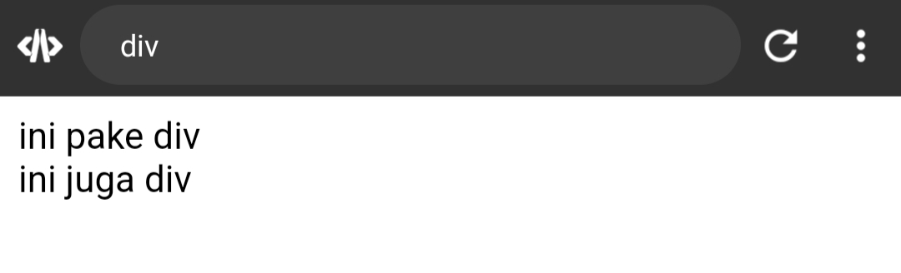
## SPAN
### Penjelasan
Mirip seperti DIV, span adalah tag HTML yang tidak punya makna apa-apa ketika berdiri sendiri. Ia berguna untuk memberi aksi atau hiasan pada sebuah atau sekelompok elemen HTML.
### Contoh
```html
```