# Apa itu web dinamis dan PHP
Web dinamis adalah jenis situs web yang menggunakan konten yang dapat berubah secara dinamis berdasarkan interaksi pengguna, data yang disimpan dalam database, atau logika bisnis tertentu. Berbeda dengan situs web statis yang memiliki konten tetap, situs web dinamis memungkinkan pengguna untuk berinteraksi dengan konten yang berubah sesuai dengan kebutuhan atau preferensi mereka.

PHP adalah bahasa pemrograman server-side yang sering digunakan untuk mengembangkan aplikasi web dinamis. Singkatan PHP adalah "Hypertext Preprocessor". PHP bekerja di sisi server, yang berarti kode PHP dijalankan di server web sebelum hasilnya dikirim ke browser pengguna. PHP dapat digunakan untuk melakukan berbagai tugas di situs web, termasuk mengambil dan menyimpan data dari database, menghasilkan halaman web secara dinamis, menangani formulir, dan banyak lagi. Ini adalah salah satu bahasa pemrograman paling populer yang digunakan untuk pengembangan web, terutama untuk situs web dinamis.

#  Echo & commentar
Echo merujuk pada tindakan mereproduksi atau membagikan kembali konten yang sudah ada kepada pengikut atau audiens Anda. Misalnya, jika seseorang memposting tweet atau kiriman di platform sosial lainnya, dan Anda memutuskan untuk membagikan kembali (retweet, share, dll.) konten tersebut kepada pengikut Anda, itu disebut sebagai "echo". Praktik ini memungkinkan untuk menyebarkan informasi lebih luas atau memberi penghargaan pada konten yang dianggap relevan atau menarik.

Komentar, di sisi lain, adalah respons atau tanggapan yang diberikan oleh pengguna terhadap konten yang diposting oleh pengguna lain. Ini bisa berupa pertanyaan, pendapat, dukungan, kritik, atau reaksi lainnya terhadap apa yang telah dibagikan. Komentar memungkinkan untuk berinteraksi dengan konten dan pengguna lainnya, membuka diskusi, atau memberikan umpan balik.

# Struktur Dasar PHP
```php
<?php

$variable = "value";
echo "menampilkan text dan variable dari $variable";

?>
```

```
menampilkan text dan variable value
```
# Program pertama
Langkah - Langkah Menghubungkan Apache dengan Text Editor(Web server)

1. Open XAMPP app
2. Start Apache in XAMPP
3. Open Fila Manager
4. Open Drive C
5. Open File XAMPP
6. Open htdocs
7. Create New Folder(Folder_name)
8. Open Text Editor app
9. Open Folder_name
10. Add New File PHP in text editor(File.php)S
11. Done
## Kode Program
```php
<?php
// Komentar satu baris
/* Komentar
banyak
baris
*/
//Variebel
$meja = 30;
$tk_kelas = "XI";
$ketua_kelas = "July";
$wali_kelas = "Saleh";
$ketua_gank = "Rahmat"; //Pengubahan nilai
//Konstanta
const KEPSEK = "Herwelis";
define('Kelas', 'RPL 1');
/*Kutip satu hanya membaca STRING, variabel  dan string
 dipisahkan dengan tanda titik*/
echo 'Jumlah meja di kelas: ' .  $meja  . ' buah';
echo "<br>";
//Kutip dua bisa membaca nilai dari sebuah variabel
    echo "sholat dulu, nabilang pak $wali_kelas dan $ketua_kelas";
echo "<br>";
//Kutip satu dibaca string disini
echo "kalo tidak, diracca' sama ketua gank $ketua_gank";
echo "<br>";
//Pemnggilan konstanta
echo 'Kepseknya ' .  KEPSEK;
echo "<br>";
echo 'Kelasnya ' . $tk_kelas . ' '. Kelas;
```


## Hasil
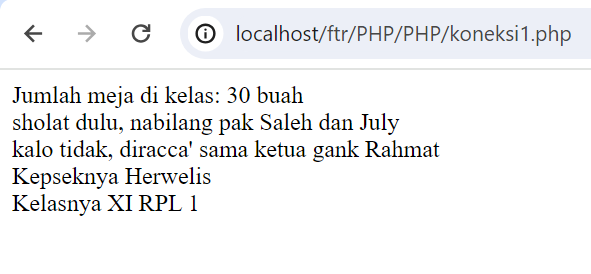


# Echo
## Kutip satu

### Kode Program
```php
$meja = 30;
echo 'Jumlah meja di kelas: ' .  $meja  . ' buah';
```
### Hasil
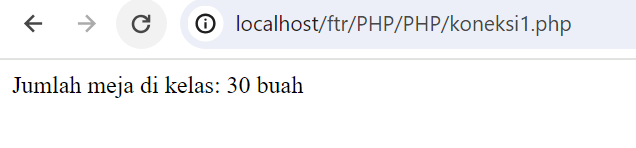

### Penjelasan
- `$meja = 30;` - Baris ini menginisialisasi sebuah variabel `$meja` dan memberinya nilai `30`.
- `echo 'Jumlah meja di kelas: ' . $meja . ' buah';` - Baris ini menampilkan teks yang mencakup nilai dari variabel `$meja`. Operator `.` digunakan untuk menggabungkan string dalam PHP.

## kutip dua
### Kode Program
```php
$ketua_kelas = "July";
$wali_kelas = "Saleh";
echo "sholat dulu, nabilang pak $wali_kelas dan $ketua_kelas";
```

### Hasil
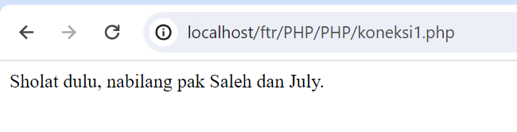

### Penjelasan
- **Inisialisasi Variabel**: Pada baris pertama dan kedua, Anda mendefinisikan dua variabel:
    
    - `$ketua_kelas` diinisialisasi dengan nilai `"July"`.
    - `$wali_kelas` diinisialisasi dengan nilai `"Saleh"`.
- **Pemanggilan `echo`**: Pada baris ketiga, Anda menggunakan perintah `echo` untuk mencetak sebuah string ke layar.
    
- **String Interpolation**: String yang Anda cetak (`"sholat dulu, nabilang pak $wali_kelas dan $ketua_kelas"`) menggunakan fitur interpolasi string PHP. Ini berarti nilai dari variabel `$wali_kelas` dan `$ketua_kelas` akan dimasukkan langsung ke dalam string pada saat eksekusi.
    
    - `$wali_kelas` akan digantikan dengan nilai `"Saleh"`.
    - `$ketua_kelas` akan digantikan dengan nilai `"July"`.
    - Bagian `"sholat dulu, nabilang pak "` adalah bagian statis dari string.
    - Bagian `$wali_kelas` diwakili sebagai `"Saleh"` karena itu nilai dari variabel `$wali_kelas`.
    - Bagian `$ketua_kelas` diwakili sebagai `"July"` karena itu nilai dari variabel `$ketua_kelas`.
- **Penutupan PHP**: Jangan lupa bahwa kode PHP diakhiri dengan `?>`, meskipun Anda tidak menempatkannya dalam contoh yang Anda berikan.

# komentar
## single line
### Kode Program
```php
//ini digunakan untuk ketika mau membuat satu baris komentar
```

### Penjelasan
Digunakan untuk menambahkan komentar pada satu baris saja. Komentar ini dimulai dengan tanda double slash (`//`) dan berlaku hingga akhir baris.


## multiple line
### Kode Program
```php
/*ini digunakan
untuk ketika 
mau membuat 
lebih dari
satu baris komentar*/
```

### Penjelasan
Digunakan untuk menambahkan komentar yang lebih dari satu baris. Komentar ini dimulai dengan `/*` dan diakhiri dengan `*/`, dan dapat mencakup beberapa baris kode.


# Variabel, Konstanta, operator
## Variabel
### Kode Program

```php
$nama = "tir"; $umur = 5;
echo "perkenalkan nama saya $nama dan umur saya $umur" 
```

### Hasil
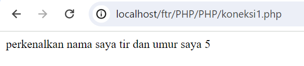

### Penjelasan
Variabel adalah tempat untuk menyimpan data yang dapat berubah nilainya selama eksekusi program. Anda bisa mendeklarasikan variabel dengan menggunakan tanda dollar ($) diikuti dengan nama variabelnya. 

## Constanta
### Kode Program
```php
const jarak
define(8, "KM");

echo "tir: Emang Seberapa jauh sih rumahmu ke sekolah"
echo "tetsuya: Hmm, mungkin Sekitar" jarak

```

### Hasil
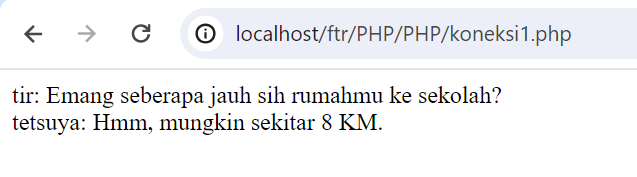

### Penjelasan
Konstanta adalah seperti variabel, tetapi nilainya tidak dapat diubah selama eksekusi program. Anda mendeklarasikan konstanta menggunakan fungsi define()

## Operator
### Aritmatika
#### Penjelasan
Operator aritmatika digunakan dalam PHP untuk melakukan operasi matematika pada bilangan. PHP mendukung operator aritmatika standar seperti penjumlahan, pengurangan, perkalian, pembagian, dan modulus.

- Penjumlahan: Menggunakan operator `+` untuk menambahkan dua bilangan.
- Pengurangan: Menggunakan operator `-` untuk mengurangkan dua bilangan.
- Perkalian: Menggunakan operator `*` untuk mengalikan dua bilangan.
- Pembagian: Menggunakan operator `/` untuk membagi dua bilangan.
- Modulus: Menggunakan operator `%` untuk mendapatkan sisa dari pembagian dua bilangan.

#### Program
```php
<?php
// Program PHP untuk demonstrasi operator aritmatika

// Deklarasi variabel
$angka1 = 10;
$angka2 = 5;

// Operasi aritmatika
$penjumlahan = $angka1 + $angka2;
$pengurangan = $angka1 - $angka2;
$perkalian = $angka1 * $angka2;
$pembagian = $angka1 / $angka2;
$modulus = $angka1 % $angka2;

// Menampilkan hasil
echo "Penjumlahan: " . $penjumlahan . "<br>";
echo "Pengurangan: " . $pengurangan . "<br>";
echo "Perkalian: " . $perkalian . "<br>";
echo "Pembagian: " . $pembagian . "<br>";
echo "Modulus: " . $modulus . "<br>";
?>

```
#### Hasil
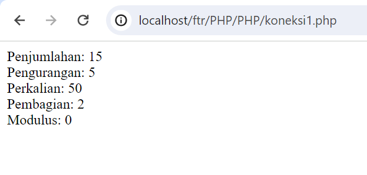
#### Analisis
Program di atas mendemonstrasikan penggunaan operator aritmatika dalam PHP untuk melakukan operasi matematika sederhana antara dua bilangan. Setiap operasi aritmatika dihitung dan hasilnya ditampilkan.
#### Kesimpulan
operator aritmatika di PHP adalah alat yang kuat untuk melakukan operasi matematika dan merupakan bagian penting dari pengembangan web dengan PHP.
### Perbandingan
#### Penjelasan
Operator perbandingan digunakan untuk membandingkan dua nilai dan menghasilkan hasil boolean (true atau false) berdasarkan hasil perbandingan tersebut. PHP mendukung operator perbandingan standar seperti `<` (kurang dari), `>` (lebih dari), `<=` (kurang dari atau sama dengan), `>=` (lebih dari atau sama dengan), `==` (sama dengan), dan `!=` (tidak sama dengan).


#### Program
```php
<?php
// Program PHP untuk demonstrasi operator perbandingan

// Deklarasi variabel
$angka1 = 10;
$angka2 = 5;

// Operasi perbandingan
$kurang_dari = $angka1 < $angka2;
$lebih_dari = $angka1 > $angka2;
$kurang_dari_sama_dengan = $angka1 <= $angka2;
$lebih_dari_sama_dengan = $angka1 >= $angka2;
$sama_dengan = $angka1 == $angka2;
$tidak_sama_dengan = $angka1 != $angka2;

// Menampilkan hasil
echo "Apakah angka1 kurang dari angka2? " . ($kurang_dari ? "Ya" : "Tidak") . "<br>";
echo "Apakah angka1 lebih dari angka2? " . ($lebih_dari ? "Ya" : "Tidak") . "<br>";
echo "Apakah angka1 kurang dari atau sama dengan angka2? " . ($kurang_dari_sama_dengan ? "Ya" : "Tidak") . "<br>";
echo "Apakah angka1 lebih dari atau sama dengan angka2? " . ($lebih_dari_sama_dengan ? "Ya" : "Tidak") . "<br>";
echo "Apakah angka1 sama dengan angka2? " . ($sama_dengan ? "Ya" : "Tidak") . "<br>";
echo "Apakah angka1 tidak sama dengan angka2? " . ($tidak_sama_dengan ? "Ya" : "Tidak") . "<br>";
?>

```
#### Hasil
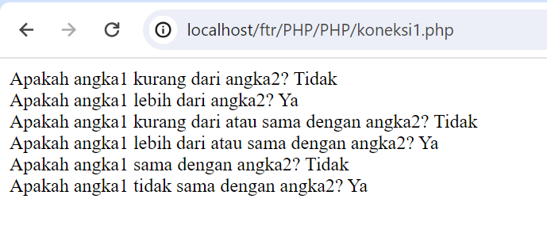
#### Analisis
Program di atas mengilustrasikan penggunaan operator perbandingan dalam PHP untuk membandingkan dua nilai numerik. Setiap operasi perbandingan dievaluasi dan hasilnya ditampilkan dalam bentuk teks (Ya atau Tidak) berdasarkan hasil perbandingan.
#### Kesimpulan
Dengan menggunakan operator perbandingan di PHP, kita dapat membandingkan dua nilai dengan mudah dan menghasilkan hasil boolean berdasarkan hasil perbandingan tersebut. Ini memungkinkan pengembang untuk membuat keputusan dalam kode berdasarkan hubungan antara nilai-nilai tersebut.
### Logika
#### Penjelasan
Operator logika digunakan untuk menggabungkan beberapa kondisi boolean dan menghasilkan nilai boolean baru. PHP mendukung operator logika standar seperti `&&` (AND logika), `||` (OR logika), dan `!` (NOT logika).

- AND Logika (`&&`): Menghasilkan `true` jika kedua kondisi adalah `true`.
- OR Logika (`||`): Menghasilkan `true` jika salah satu kondisi atau kedua kondisi adalah `true`.
- NOT Logika (`!`): Menghasilkan kebalikan nilai dari kondisi yang diberikan.

#### Program
```php
<?php
// Program PHP untuk demonstrasi operator logika

// Deklarasi variabel
$nilai1 = 10;
$nilai2 = 5;

// Operasi logika
$and = ($nilai1 > 5) && ($nilai2 < 10);
$or = ($nilai1 < 5) || ($nilai2 > 10);
$not = !($nilai1 == $nilai2);

// Menampilkan hasil
echo "AND Logika: " . ($and ? "True" : "False") . "<br>";
echo "OR Logika: " . ($or ? "True" : "False") . "<br>";
echo "NOT Logika: " . ($not ? "True" : "False") . "<br>";
?>

```
#### Hasil
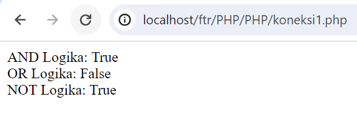
#### Analisis
Program di atas menggambarkan penggunaan operator logika dalam PHP untuk mengevaluasi beberapa kondisi boolean dan menghasilkan hasil logika berdasarkan operasi yang dilakukan. Setiap operasi logika dievaluasi dan hasilnya ditampilkan dalam bentuk teks (True atau False) berdasarkan hasil logika.
#### Kesimpulan
perator logika di PHP adalah alat yang penting dalam pengembangan web untuk membuat keputusan yang bergantung pada kondisi-kondisi yang diberikan.
# Conditional Statement
## IF
### Penjelasan
Kondisional statement `IF` digunakan untuk melakukan pemeriksaan kondisi tertentu. Jika kondisi tersebut benar (true), maka blok kode di dalam IF akan dieksekusi. Jika kondisi salah (false), maka blok kode tersebut tidak dieksekusi.

### Struktrur Program
```php
if (kondisi) {
    // blok kode yang akan dieksekusi jika kondisi benar
}
```

### Kode Program
```php
$nilai = 80;
if ($nilai >= 70) {
    echo "Nilai Anda lulus.";
}
```

### Hasil
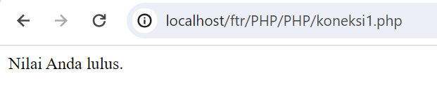
### Analisis
- Baris 1: Sebuah variabel `$nilai` diinisialisasi dengan nilai 80.
- Baris 2: Kondisi dievaluasi, yaitu apakah nilai `$nilai` lebih besar atau sama dengan 70.
- Baris 3: Karena kondisi benar (true), maka blok kode di dalam IF dieksekusi.
- Baris 4: Mencetak teks "Nilai Anda lulus." karena nilai `$nilai` memenuhi kondisi.

### Kesimpulan Program
Program akan mencetak "Nilai Anda lulus." karena nilai `$nilai` adalah 80, yang lebih besar dari atau sama dengan 70.

## Else IF

### Penjelasan

Kondisional statement `Else IF` digunakan untuk menambahkan kondisi tambahan setelah kondisi IF. Jika kondisi IF tidak terpenuhi (false), maka kondisi Else IF akan dicek. Jika kondisi Else IF benar (true), maka blok kode di dalam Else IF akan dieksekusi.

### Struktur program

```php
if (kondisi1) {     
// blok kode yang akan dieksekusi jika kondisi1 benar 
} else if (kondisi2) {     
// blok kode yang akan dieksekusi jika kondisi2 benar 
}
```

### Kode Program
```php
$nilai = 55; 
if ($nilai >= 70) {  
echo "Nilai Anda lulus."; 
} else if ($nilai >= 60) {
echo "Anda dapat remedial."; 
} else { 
echo "Anda tidak lulus.";
}
```

### Hasil
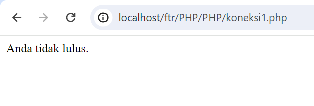

### Analisis

- Baris 1: Sebuah variabel `$nilai` diinisialisasi dengan nilai 55.
- Baris 2: Kondisi pertama dievaluasi, yaitu apakah nilai `$nilai` lebih besar atau sama dengan 70. Kondisi ini tidak terpenuhi (false).
- Baris 3: Kondisi kedua dievaluasi, yaitu apakah nilai `$nilai` lebih besar atau sama dengan 60. Kondisi ini juga tidak terpenuhi (false).
- Baris 4: Karena kedua kondisi sebelumnya tidak terpenuhi, maka blok kode di dalam ELSE dieksekusi.
- Baris 5: Mencetak teks "Anda tidak lulus." karena nilai `$nilai` kurang dari 60.

### Kesimpulan Program

Program akan mencetak "Anda tidak lulus." karena nilai `$nilai` adalah 55, yang kurang dari 60.


## Else

### Penjelasan

Kondisional statement `Else` digunakan untuk mengeksekusi blok kode tertentu jika kondisi IF sebelumnya tidak terpenuhi (false).

### Struktur program
```php
if (kondisi){     
// blok kode yang akan dieksekusi jika kondisi benar 
} else {     
// blok kode yang akan dieksekusi jika kondisi salah 
}
```

### Kode Program
```php
$nilai = 55; 
if ($nilai >= 60) 
{
echo "Nilai Anda lulus."; 
} else { 
echo "Anda tidak lulus.";
}
```

### Hasil
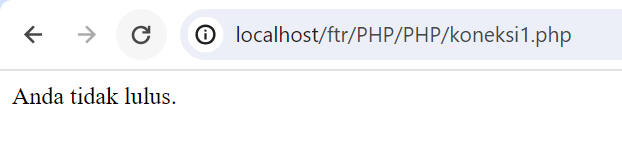

### Analisis

- Baris 1: Sebuah variabel `$nilai` diinisialisasi dengan nilai 55.
- Baris 2: Kondisi dievaluasi, yaitu apakah nilai `$nilai` lebih besar atau sama dengan 60. Kondisi ini tidak terpenuhi (false).
- Baris 3: Karena kondisi sebelumnya tidak terpenuhi, maka blok kode di dalam ELSE dieksekusi.
- Baris 4: Mencetak teks "Anda tidak lulus." karena nilai `$nilai` kurang dari 60.

### Kesimpulan Program

Program akan mencetak "Anda tidak lulus." karena nilai `$nilai` adalah 55, yang kurang dari 60.

## if-else-if-else
### Penjelasan
Pernyataan if-else-if-else digunakan ketika terdapat beberapa kondisi yang harus diuji secara berurutan. 
### Struktur
```php
if (kondisi1) {
    // Blok kode yang dijalankan jika kondisi1 benar
} elseif (kondisi2) {
    // Blok kode yang dijalankan jika kondisi2 benar
} else {
    // Blok kode yang dijalankan jika semua kondisi salah
}
```

### Kode Program
```php
$nilai = 75;

if ($nilai >= 80) {
    echo "Selamat, Anda mendapatkan nilai A!";
} elseif ($nilai >= 70) {
    echo "Anda mendapatkan nilai B.";
} elseif ($nilai >= 60) {
    echo "Anda mendapatkan nilai C.";
} else {
    echo
```

### Hasil
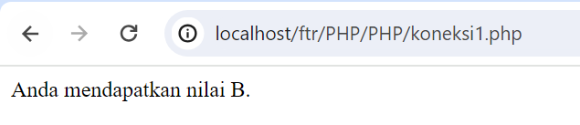
### Analisis:

Variabel $nilai diberikan nilai 75.
Pernyataan if pertama digunakan untuk menguji apakah nilai $nilai lebih besar atau sama dengan 80.
Karena nilai $nilai tidak mencapai 80, maka blok kode di dalam if pertama tidak akan dieksekusi.
Pernyataan elseif pertama digunakan untuk menguji apakah nilai $nilai lebih besar atau sama dengan 70.
Karena nilai $nilai adalah 75 dan memenuhi kondisi $nilai >= 70, blok kode di dalam elseif pertama akan dieksekusi.
Blok kode di dalam elseif pertama mencetak pesan "Anda mendapatkan nilai B." menggunakan pernyataan echo.
Setelah blok kode di dalam elseif pertama dieksekusi, program akan keluar dari struktur kondisional dan berakhir.
Kesimpulan:

Jika variabel $nilai memiliki nilai 75, maka kondisi $nilai >= 80 akan salah, namun kondisi $nilai >= 70 akan benar. Oleh karena itu, pesan "Anda mendapatkan nilai B." akan ditampilkan

## Switch Case

### Penjelasan

Kondisional statement `Switch Case` digunakan untuk membandingkan nilai ekspresi dengan beberapa nilai yang mungkin. Jika nilai ekspresi cocok dengan salah satu nilai `case`, maka blok kode di dalam `case` tersebut akan dieksekusi.

### Struktur program
```php
switch (ekspresi) {     
case nilai1:         
// blok kode yang akan dieksekusi jika ekspresi sama dengan nilai1         
break;     
case nilai2:         
// blok kode yang akan dieksekusi jika ekspresi sama dengan nilai2         
break;     
default:         
// blok kode yang akan dieksekusi jika tidak ada case yang cocok 
}
```


### Kode Program


```php
$nilai = 'B'; switch ($nilai) {    
case 'A':         
echo "Anda sangat baik.";
break;    
case 'B':  
echo "Anda baik.";  
break;     
case 'C':        
echo "Anda cukup.";
break;     
default: 
echo "Anda tidak lulus."; 
}
```

### Hasil
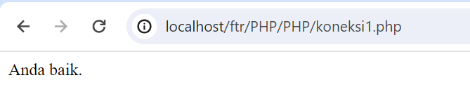

### Analisis

- Baris 1: Sebuah variabel `$nilai` diinisialisasi dengan nilai 'B'.
- Baris 2: Nilai `$nilai` dibandingkan dengan nilai-nilai case di dalam switch.
- Baris 3-5: Karena nilai `$nilai` sama dengan 'B', maka blok kode di dalam case 'B' dieksekusi.
- Baris 6: Mencetak teks "Anda baik." karena nilai `$nilai` sama dengan 'B'.

### Kesimpulan Program

Program akan mencetak "Anda baik." karena nilai `$nilai` adalah 'B', yang cocok dengan case 'B'.

# Array

### Array 1 Dimensi

#### Penjelasan

Array 1 dimensi adalah struktur data yang dapat menyimpan beberapa nilai dalam satu variabel. Setiap nilai dalam array memiliki indeks numerik yang dimulai dari 0.

#### Struktur program
```php
$nama_array = array(nilai1, nilai2, nilai3, ...);
```

##### Kode Program
```php
$buah = array(
"Apel", "Jeruk", "Mangga", "Anggur"
); 
echo "Saya suka makan " . $buah[0];
```

#### Hasil
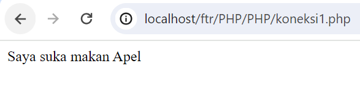


#### Analisis

- Baris 1: Membuat array `$buah` dengan nilai "Apel", "Jeruk", "Mangga", dan "Anggur".
- Baris 2: Mencetak teks "Saya suka makan Apel" karena nilai dengan indeks 0 dalam array adalah "Apel".

#### Kesimpulan Program

Program akan mencetak "Saya suka makan Apel" karena nilai dengan indeks 0 dalam array `$buah` adalah "Apel".

### Array Asosiatif

#### Penjelasan

Array asosiatif adalah struktur data yang menggunakan nama kunci (key) untuk setiap nilai dalam array. Ini memungkinkan kita untuk mengakses nilai berdasarkan kunci yang ditetapkan.

#### Struktur program

```php
$nama_array = array("kunci1" => nilai1, "kunci2" => nilai2, "kunci3" => nilai3, ...);
```
#### Kode Program

```php
$siswa = array("nama" => "tir", "umur" => 20, "kelas" => "XII"); 
echo $siswa["nama"] . " berusia " . $siswa["umur"] . " tahun.";
```


#### Hasil
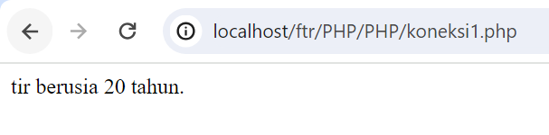


#### Analisis

- Baris 1: Membuat array `$siswa` dengan kunci "nama", "umur", dan "kelas".
- Baris 2: Menggunakan kunci "nama" dan "umur" untuk mengakses nilai dalam array `$siswa`.
- Baris 2: Mencetak teks "John berusia 20 tahun."

#### Kesimpulan Program

Program akan mencetak "John berusia 20 tahun." karena nilai dengan kunci "nama" adalah "tir" dan nilai dengan kunci "umur" adalah 20 dalam array `$siswa`.

### Array Multidimensi

#### Penjelasan

Array multidimensi adalah array yang memiliki satu atau lebih array di dalamnya. Hal ini memungkinkan kita untuk membuat struktur data yang kompleks, seperti matriks.

#### Struktur program
```php
$nama_array = array(     
array(nilai1, nilai2, nilai3, ...),     
array(nilai1, nilai2, nilai3, ...),     
... );
```
#### Kode Program
```php
$matriks = array(  
array(1, 2, 3),  
array(4, 5, 6),
array(7, 8, 9) ); 
echo $matriks[1][2]; // Mengakses nilai 6
```

#### Hasil
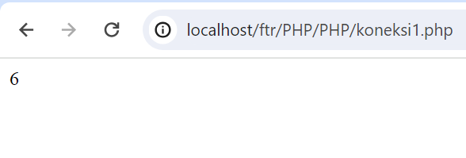


#### Analisis

- Baris 1-3: Membuat array `$matriks` yang berisi array-array dengan nilai tertentu.
- Baris 4: Menggunakan indeks 1 dan 2 untuk mengakses nilai 6 dalam array `$matriks`.
- Baris 4: Mencetak nilai 6.

#### Kesimpulan Program

Program akan mencetak nilai 6 karena nilai tersebut berada di indeks 1 dan 2 dalam array `$matriks`.

# Var_Dump
## Penjelasan
ungsi `var_dump()` di PHP. Fungsi ini digunakan untuk menampilkan informasi rinci tentang tipe dan nilai dari satu atau lebih variabel, termasuk struktur dan ukuran dari array dan objek.
## Struktur
1. **Penggunaan `var_dump()`**: Memanggil fungsi `var_dump()` untuk menampilkan informasi tentang satu atau lebih variabel.
2. **Output**: Menampilkan informasi rinci tentang tipe dan nilai dari variabel yang diberikan.
## Program
```php
<?php
// Variabel-variabel contoh
$nama = "John Doe";
$umur = 30;
$tinggi = 175.5;
$hobi = array("Membaca", "Bersepeda", "Memasak");

// Menampilkan informasi tentang variabel menggunakan var_dump()
echo "Informasi tentang variabel \$nama:\n";
var_dump($nama);

echo "\nInformasi tentang variabel \$umur:\n";
var_dump($umur);

echo "\nInformasi tentang variabel \$tinggi:\n";
var_dump($tinggi);

echo "\nInformasi tentang variabel \$hobi:\n";
var_dump($hobi);
?>

```
## Hasil
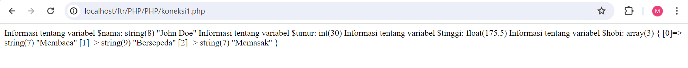
## Analisis
1. Program memanggil fungsi `var_dump()` untuk menampilkan informasi rinci tentang beberapa variabel yang berbeda.
2. Setiap variabel dipass sebagai argumen ke fungsi `var_dump()`, dan informasi rinci tentang tipe dan nilai dari variabel tersebut ditampilkan sebagai output.
3. Output dari `var_dump()` juga akan menunjukkan struktur dan ukuran dari array dan objek, jika variabel yang diberikan merupakan array atau objek.
## Kesimpulan
Fungsi `var_dump()` sangat berguna untuk debugging dan pemahaman mendalam tentang variabel dalam kode PHP. Dengan menggunakan `var_dump()`, kita dapat melihat tipe data dari variabel, nilai-nilai yang disimpan di dalamnya, serta struktur dan ukuran dari array dan objek. Ini membantu kita dalam mengidentifikasi masalah dan memahami bagaimana data disimpan dan diakses dalam program kita. Dalam konteks debugging, `var_dump()` adalah alat yang sangat berguna untuk menganalisis variabel dengan lebih mendalam.

## Looping

### For

#### Penjelasan

For loop digunakan untuk mengulang blok kode sejumlah tertentu kali. Ini sering digunakan ketika kita sudah mengetahui berapa kali iterasi yang diperlukan.

#### Struktur program
```php
for (inisialisasi; kondisi; perubahan){     
// blok kode yang akan diulang 
}
```
#### Kode Program
```php
for ($i = 1; $i <= 5; $i++) { 
echo "Nomor: $i <br>"; 
}
```

### Hasil


#### Analisis

- Baris 1: Inisialisasi variabel `$i` dengan nilai 1.
- Baris 2: Kondisi, loop akan terus berjalan selama `$i` kurang dari atau sama dengan 5.
- Baris 3: Setiap iterasi, nilai `$i` akan bertambah satu.
- Baris 4: Mencetak nomor dari 1 sampai 5.
#### Kesimpulan Program

Program akan mencetak nomor dari 1 sampai 5.

### While

#### Penjelasan

While loop digunakan untuk mengulang blok kode selama kondisi tertentu bernilai true. Ini berguna ketika jumlah iterasi tidak diketahui sebelumnya.

#### Struktur program
```php
while (kondisi) {  
// blok kode yang akan diulang 
}
```
##### Kode Program
```php
$i = 1; 
while ($i <= 5) {
echo "Nomor: $i <br>";  
$i++; 
}
```

### Hasil


#### Analisis

- Baris 1: Mendeklarasikan variabel `$i` dengan nilai 1.
- Baris 2: Loop akan terus berjalan selama nilai `$i` kurang dari atau sama dengan 5.
- Baris 3: Mencetak nomor dari 1 sampai 5.
- Baris 4: Setiap iterasi, nilai `$i` akan bertambah satu.
#### Kesimpulan Program

Program akan mencetak nomor dari 1 sampai 5.

### Do-While

#### Penjelasan

Do-While loop mirip dengan While loop, namun perbedaannya adalah Do-While loop akan menjalankan blok kode setidaknya sekali, bahkan jika kondisi tidak terpenuhi.

#### Struktur program
```php
do {     
// blok kode yang akan diulang 
} 
while (kondisi);
```
#### Kode Program
```php
$i = 1; do {     
echo "Nomor: $i <br>"; 
$i++; } 
while ($i <= 5);
```

### Hasil


#### Analisis

- Baris 1: Mendeklarasikan variabel `$i` dengan nilai 1.
- Baris 2-4: Mencetak nomor dari 1 sampai 5. Walaupun kondisi tidak terpenuhi, blok kode akan dijalankan sekali karena sifat Do-While loop.
#### Kesimpulan Program

Program akan mencetak nomor dari 1 sampai 5.

### Foreach

#### Penjelasan

Foreach loop digunakan untuk mengulang elemen-elemen dalam sebuah array. Loop ini berguna untuk mengakses setiap nilai dalam array tanpa harus mengkhawatirkan indeksnya.

#### Struktur program
```php
foreach ($array as $nilai) {  
// blok kode yang akan diulang 
}
```
#### Kode Program
```php
$buah = array("Apel", "Jeruk", "Mangga", "Anggur"); 
foreach ($buah as $nama) {
echo "Saya suka makan $nama <br>"; 
}
```

### Hasil


#### Analisis

- Baris 1: Mendefinisikan array `$buah`.
- Baris 2: Foreach loop akan mengulang setiap nilai dalam array `$buah` dan menyimpannya dalam variabel `$nama`.
- Baris 3: Mencetak teks "Saya suka makan ..." untuk setiap nilai dalam array `$buah`.
#### Kesimpulan Program

Program akan mencetak teks "Saya suka makan ..." untuk setiap nilai dalam array `$buah`.

### Function

#### Penjelasan

Function digunakan untuk mengelompokkan blok kode yang akan dijalankan secara bersamaan. Ini memungkinkan kita untuk menggunakan kode yang sama berulang kali tanpa harus menulis ulang.

#### Struktur program
```php
function nama_function($parameter1, $parameter2, ...) 
{     // blok kode yang akan dijalankan 
}
```


#### Kode Program
```php
function tambah($a, $b) {
return $a + $b; 
} 
$hasil = tambah(5, 3); 
echo "Hasil penjumlahan: $hasil";
```

### Hasil


#### Analisis

- Baris 1-3: Mendefinisikan function `tambah` yang menerima dua parameter `$a` dan `$b` dan mengembalikan hasil penjumlahan.
- Baris 5: Memanggil function `tambah` dengan nilai 5 dan 3 sebagai parameter.
- Baris 6: Mencetak hasil penjumlahan.

#### Kesimpulan Program

Program akan mencetak hasil penjumlahan dari 5 dan 3, yaitu 8.

## PHP Form

### GET Method

#### Penjelasan

Metode GET digunakan untuk mengirimkan data form ke server dalam URL. Data form akan terlihat pada URL dan cocok untuk digunakan dalam kasus-kasus di mana data yang dikirimkan tidak sensitif.

#### Struktur program
```html
<form action="proses.php" method="get"> 
<label for="nama">Nama:</label>
<input type="text" id="nama" name="nama">
<br>     
<label for="email">Email:</label>
<input type="email" id="email" name="email">
<br> 
<input type="submit" value="Submit">
</form>
```
#### Kode Program 
```php
<?php if (isset($_GET['nama']) && isset($_GET['email'])) { 
$nama = $_GET['nama'];
$email = $_GET['email']; 
echo "Nama: $nama <br>";
echo "Email: $email"; } 
?>
```

### Hasil


#### Analisis

- Baris 1: Membuat form dengan action menuju `proses.php` dan method GET.
- Baris 2-5: Membuat input untuk nama dan email.
- Baris 6: Menggunakan input submit untuk mengirimkan form.
- Baris 2 (proses.php): Memeriksa apakah variabel `$_GET['nama']` dan `$_GET['email']` sudah di-set.
- Baris 3-4 (proses.php): Jika sudah di-set, maka variabel `$nama` dan `$email` akan diisi dengan nilai dari form dan dicetak.

#### Kesimpulan Program

Jika form diisi dan dikirim, halaman `proses.php` akan mencetak nama dan email yang diisi dalam form.

### POST Method

#### Penjelasan

Metode POST digunakan untuk mengirimkan data form ke server dalam bentuk tersembunyi. Data form tidak akan terlihat pada URL dan cocok untuk digunakan dalam kasus-kasus di mana data yang dikirimkan sensitif.

#### Struktur program
```php
<?php 
if ($_SERVER["REQUEST_METHOD"] == "POST") {
    // Proses data yang dikirim melalui metode POST
    $nama = $_POST['nama'];
    $email = $_POST['email'];
    // Contoh output
    echo "Nama: $nama <br>";
	echo "Email: $email";
}
?>
```

#### Kode Program
```php
<?php 
if ($_SERVER["REQUEST_METHOD"] == "POST") {
    // Proses data yang dikirim melalui metode POST
    $nama = $_POST['nama'];
    $email = $_POST['email'];
    // Contoh output
    echo "Nama: $nama <br>";
    echo "Email: $email";
}
?>
```

### Hasil


	

#### Analisis

- Struktur form dan prosesnya sama dengan metode GET, namun menggunakan `method="post"` pada form.
- Data form akan dikirimkan ke halaman `proses.php` menggunakan metode POST.
- Halaman `proses.php` akan mengakses data form menggunakan `$_POST` dan mencetaknya.

#### Kesimpulan Program

Program akan mencetak nama dan email yang diisi dalam form setelah form dikirim dengan metode POST.


# Looping (Perulangan)
## FOR
### Penjelasan
penggunaan struktur perulangan `for` di PHP. Perulangan `for` digunakan untuk mengeksekusi blok kode berulang kali selama kondisi tertentu terpenuhi.
### Struktur
```php
for (inisialisasi; kondisi; perubahan) {
    // blok kode yang akan diulang
}
```
### Program
```php
<?php
echo "Menampilkan angka 1 sampai 5: <br>";
for ($i = 1; $i <= 5; $i++) {
    echo $i . "<br>";
}
?>

```
### Hasil
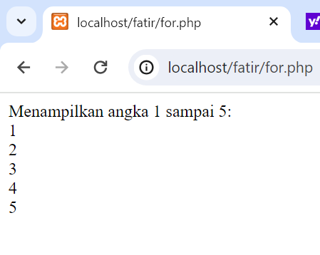
### Analisis
1. Program menggunakan perulangan `for` untuk menampilkan angka dari 1 sampai 5.
2. Variabel `$i` digunakan sebagai variabel kontrol perulangan yang diinisialisasi dengan nilai 1.
3. Perulangan akan terus berlangsung selama nilai `$i` kurang dari atau sama dengan 5.
4. Setiap iterasi, nilai `$i` akan ditampilkan, kemudian nilai `$i` akan bertambah satu setelah setiap iterasi.
### Kesimpulan
Perulangan `for` adalah alat yang kuat dalam pemrograman untuk mengeksekusi serangkaian instruksi berulang kali.
## While
### Penjelasan
penggunaan struktur perulangan `while` di PHP. Perulangan `while` digunakan untuk mengeksekusi blok kode selama kondisi yang diberikan benar.
### Struktur
```php
while (kondisi) {
    // blok kode yang akan diulang
    // perubahan kondisi harus dilakukan di dalam blok kode
}
```
### Program
```php
<?php

$counter = 1;

echo "Menampilkan angka 1 sampai 10: <br>";
while ($counter <= 10) {
    echo $counter . "<br>";
    $counter++;
}
?>

```
### Hasil
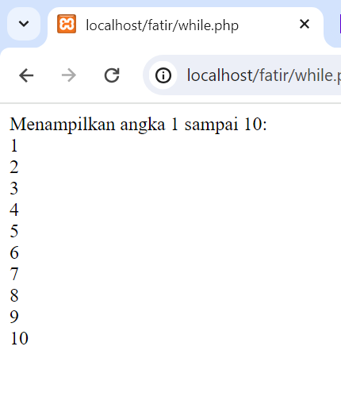
### Analisis
1. Program menggunakan perulangan `while` untuk menampilkan angka dari 1 sampai 10.
2. Variabel `$counter` diinisialisasi dengan nilai 1 di luar perulangan.
3. Perulangan akan terus berlangsung selama nilai `$counter` kurang dari atau sama dengan 10.
4. Setiap iterasi, nilai `$counter` akan ditampilkan, kemudian nilai `$counter` akan ditambah satu untuk menghindari perulangan tak terbatas.
### Kesimpulan
Perulangan `while` adalah cara yang efektif untuk mengeksekusi serangkaian instruksi selama kondisi tertentu terpenuhi
## Do While
### Penjelasan
penggunaan struktur perulangan `do-while` di PHP. Perulangan `do-while` mirip dengan perulangan `while`, namun blok kode di dalamnya akan dieksekusi setidaknya satu kali, bahkan jika kondisi awalnya salah.
### Struktur
```php
do {
    // blok kode yang akan diulang
    // perubahan kondisi harus dilakukan di dalam blok kode
} while (kondisi);
```
### Program
```php
<?php

$counter = 1;

echo "Menampilkan angka 1 sampai 15: <br>";
do {
    echo $counter . "<br>";
    $counter++;
} while ($counter <= 15);
?>

```
### Hasil
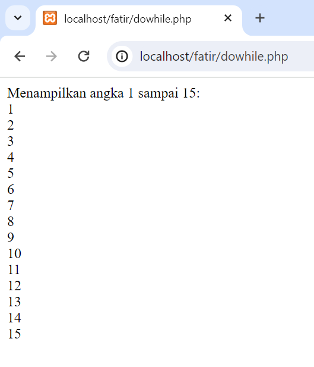
### Analisis
1. Program menggunakan perulangan `do-while` untuk menampilkan angka dari 1 sampai 5.
2. Variabel `$counter` diinisialisasi dengan nilai 1 sebelum perulangan dimulai.
3. Blok kode di dalam perulangan akan dieksekusi setidaknya satu kali sebelum kondisi di dalam `while` dievaluasi.
4. Setelah setiap iterasi, nilai `$counter` akan diperbarui dan kondisi akan dievaluasi kembali. Perulangan akan berlanjut selama kondisi yang ditentukan benar.
### Kesimpulan
Perulangan `do-while` berguna ketika kita ingin menjalankan suatu blok kode setidaknya sekali, bahkan jika kondisi awalnya salah.
## Foreach
### Penjelasan
penggunaan struktur perulangan `foreach` di PHP. Perulangan `foreach` digunakan untuk mengulang setiap elemen dalam array.
### Struktur
```php
foreach ($array as $nilai) {
    // blok kode yang akan diulang
}
```
### Program
```php
<?php

$buah = array("Apel", "Pisang", "Jeruk", "Mangga", "Anggur");

echo "Menampilkan nama-nama buah: <br>";
foreach ($buah as $nama_buah) {
    echo $nama_buah . "<br>";
}
?>

```
### Hasil
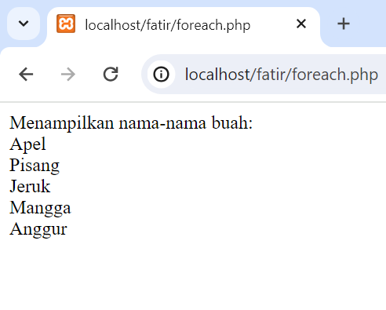
### Analisis
1. Program menggunakan perulangan `foreach` untuk mengulang setiap elemen dalam array `$buah`.
2. Variabel `$nama_buah` digunakan untuk menyimpan nilai setiap elemen dalam setiap iterasi perulangan.
3. Blok kode di dalam perulangan akan dieksekusi sekali untuk setiap elemen dalam array, dan nilai elemen tersebut akan ditampilkan.
### Kesimpulan
Perulangan `foreach` adalah alat yang sangat berguna untuk mengulang setiap elemen dalam array tanpa perlu mengkhawatirkan tentang indeks atau panjang array.


# Funcition
## Penjelasan
Program ini adalah contoh sederhana dari penggunaan fungsi di PHP. Fungsi digunakan untuk mengelompokkan serangkaian pernyataan ke dalam blok tunggal, sehingga dapat digunakan kembali dan dipanggil berkali-kali di berbagai bagian program.
## Struktur
```php
function nama_function(parameter1, parameter2, ...) {
    // Blok kode yang dijalankan ketika function dipanggil
    // ...
    return nilai;
}
```
## Program
```php
<?php
// Deklarasi fungsi untuk menghitung luas segitiga
function hitungLuasSegitiga($alas, $tinggi) {
    $luas = 0.5 * $alas * $tinggi;
    return $luas;
}

// Memanggil fungsi dan menampilkan hasilnya
$luas_segitiga = hitungLuasSegitiga(6, 8);
echo "Luas segitiga: " . $luas_segitiga;
?>

```
## Hasil

## Analisis
1. Program mendefinisikan fungsi `hitungLuasSegitiga()` yang menerima dua parameter, yaitu alas dan tinggi segitiga.
2. Di dalam fungsi, luas segitiga dihitung menggunakan formula matematika yang tepat, dan kemudian nilai luas tersebut dikembalikan menggunakan pernyataan `return`.
3. Fungsi dipanggil dengan menyediakan argumen sesuai dengan parameter yang diterima, dan hasilnya ditampung dalam variabel `$luas_segitiga`.
4. Hasil perhitungan luas segitiga kemudian ditampilkan menggunakan pernyataan `echo`.
## Kesimpulan
Fungsi adalah alat yang sangat berguna dalam pemrograman PHP untuk mengorganisir dan mengelompokkan kode ke dalam unit yang dapat digunakan kembali.
# PHP From
## Get Method
### Penjelasan
Metode GET adalah salah satu metode pengiriman data dari client ke server dalam protokol HTTP. Dalam PHP, kita dapat menggunakan metode GET untuk mengirim data melalui URL. 
### Struktur
```php
<?php

// Dapatkan nilai parameter
$q = $_GET['q'];

// Lakukan sesuatu dengan data yang dikirimkan
echo "Anda mencari: $q<br>";

?>
```

### Code
```html
<!DOCTYPE html>
<html>
<head>
    <title>Form GET</title>
</head>
<body>
    <form method="GET" action="test2.php">
        <label for="name">Nama:</label>
        <input type="text" name="name" id="name">
        <br>
        <label for="age">Usia:</label>
        <input type="text" name="age" id="age">
        <br>
        <input type="submit" value="Submit">
    </form>
</body>
</html>
```

```php
<?php
if (isset($_GET['name']) && isset($_GET['age'])) {
    $name = $_GET['name'];
    $age = $_GET['age'];
  
    echo "Nama: " . $name . "<br>";
    echo "Usia: " . $age;
}
?>
```

### Hasil
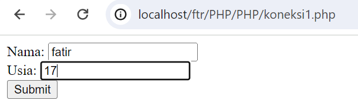

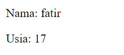
### Aanlisis:

Bagian HTML:
- Program HTML ini menampilkan sebuah form dengan metode GET yang mengirimkan data ke file "test2.php" saat tombol "Submit" ditekan.
- Form memiliki dua input field yaitu "Nama" dan "Usia" yang masing-masing memiliki atribut name yang sesuai.
- Ketika tombol "Submit" ditekan, data yang diisi oleh pengguna akan dikirimkan ke file "test2.php" untuk diproses.
Bagian PHP:
- Program PHP ini berada di bawah tag penutup HTML (?>) dan akan dieksekusi saat form dikirimkan.
- Program menggunakan isset() untuk memeriksa apakah parameter name dan age telah dikirim melalui metode GET.
- Jika parameter tersebut ada dalam URL, program akan mengambil nilai-nilainya menggunakan $_GET['name'] dan $_GET['age'].
- Selanjutnya, program akan menampilkan nilai-nilai tersebut dengan menggunakan echo untuk mencetak pesan "Nama: [nama]" dan "Usia: [usia]" di halaman.

### Kesimpulan:

 Program tersebut adalah contoh sederhana yang menggunakan metode GET dalam PHP untuk mengambil data yang dikirim melalui form HTML. Ketika form dikirimkan, data yang diisi oleh pengguna akan dikirim melalui URL sebagai parameter dan nilai yang dapat diakses melalui $_GET di file "test2.php". Program kemudian mengambil nilai-nilai tersebut dan menampilkannya di halaman dengan menggunakan echo. Pastikan file "test2.php" tersedia dan dapat diakses dengan benar serta server web Anda telah dikonfigurasi untuk menjalankan PHP. Setelah form dikirimkan, Anda akan melihat pesan "Nama: [nama]" dan "Usia: [usia]" di halaman "test2.php" sesuai dengan data yang diisi oleh pengguna.

## Post Method
### Penjelasan:

Metode POST digunakan untuk mengirimkan data dari client ke server. Data dikirimkan dalam tubuh permintaan HTTP dan tidak terlihat dalam URL seperti metode GET. Metode POST lebih aman untuk mengirim data sensitif seperti kata sandi. Dalam PHP, data yang dikirim melalui metode POST dapat diakses menggunakan variabel global $_POST. 

### Struktur:
```php
<?php

// Periksa apakah formulir telah dikirimkan
if ($_SERVER['REQUEST_METHOD'] === 'POST') {

  // Dapatkan nilai field formulir
  $name = $_POST['name'];
  $email = $_POST['email'];

  // Lakukan sesuatu dengan data yang dikirimkan
  echo "Nama: $name<br>";
  echo "Email: $email<br>";
}

?>
```

### Code
```Html
<html lang="en">
<head>
    <title>Document</title>
</head>
<body>
    <!-- Pada atribut action, kalian tuliskan nama file php yang bertugas untuk mengelola atau menangkap data dari form tersebut. -->
    <form action="proses_post.php" method="POST">
        <input type="text" name="nama_lengkap" placeholder="Masukkan nama">
        <input type="number" name="umur" placeholder="Masukkan umur">
        <input type="password" name="password" placeholder="Masukkan password"><br>
        <button type="submit">Kirim</button>
    </form>
</body>
</html>

```

```php
<?php

// Key dari array-nya, sesuai dengan nama dari atribut name di setiap input-nya
$nama = $_POST["nama"];
$umur = $_POST["umur"];
  
var_dump($_POST);
?>
  
<!DOCTYPE html>
<html lang="en">
<head>
    <title> XI RPL 1 - POST</title>
</head>
<body>
    <p>Nama anda <?= $_POST["nama_lengkap"] ?></p>
    <p>Umur anda <?= $umur ?> tahun</p>
    <p>Password anda aman!</p>
</body>
</html>
```

### Hasil
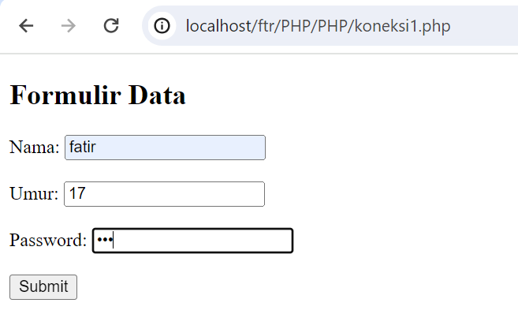

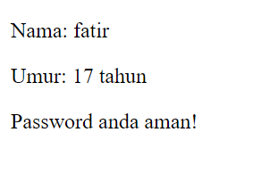
### Anlisis:
Pada bagian HTML:
-  Formulir menggunakan metode POST (`method="POST"`), yang cocok untuk mengirim data sensitif seperti password.
- Atribut `action="proses_post.php"` menunjukkan bahwa data dari formulir akan dikirim ke skrip PHP bernama `proses_post.php` untuk diproses.
- Setiap input memiliki atribut `name` yang akan digunakan untuk mengidentifikasi nilai yang dikirimkan ke skrip PHP.
- Input untuk `nama_lengkap` (tipe `text`), `umur` (tipe `number`), dan `password` (tipe `password`) disertakan, dengan masing-masing menyertakan placeholder untuk memberi petunjuk kepada pengguna.

Pada bagian PHP
- - `$umur = $_POST["umur"];`: Mengambil nilai dari input dengan nama `umur`.
        
    - `htmlspecialchars($nama_lengkap)`: Digunakan untuk menghindari serangan XSS (Cross-Site Scripting) dengan mengonversi karakter khusus HTML menjadi entitas HTML.
        
    - Pesan "Password anda aman!" ditampilkan secara statis untuk memberikan umpan balik yang aman kepada pengguna.
### Kesimpulan
Program ini adalah sebuah halaman HTML dengan form yang mengirim data menggunakan metode POST. Data yang dikirim kemudian ditangkap di file "proses_post.php" menggunakan variabel $_POST. Namun, ada ketidaksesuaian antara atribut name pada input field dengan variabel yang digunakan di PHP. Sehingga, program ini perlu diperbaiki dengan mengganti atribut name="nama_lengkap" menjadi name="nama" agar sesuai dengan variabel yang digunakan di PHP. Selain itu, program juga bisa ditingkatkan dengan penanganan data yang lebih baik, seperti validasi input, sanitasi data, dan penggunaan metode keamanan yang lebih baik untuk mengelola password.