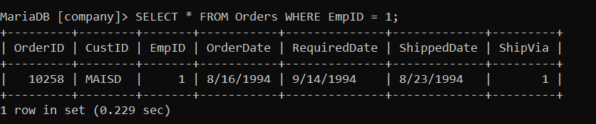
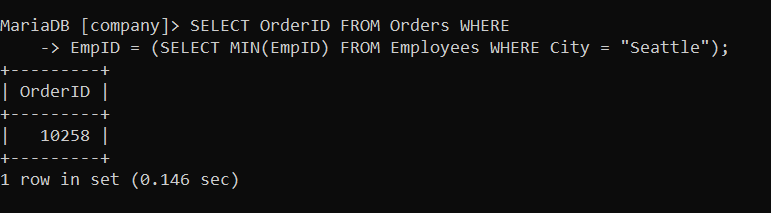

# Tabel Employees

___
# Tabel Orders

___
#  Query 1
```sql
SELECT * FROM Employees WHERE
City = (SELECT City FROM Employees WHERE LastName = 'Callahan');
```

- `SELECT` untuk memilih kolom mana saja yang ingin di tampilkan
- `*` tanda untuk memilih semua kolom yang ada pada tabel yang di pilih
- `FROM Employees` merupakan nama tabel yang di pilih untuk ditampilkan kolomnya
- `WHERE` kondisi yang harus di penuhi suatu data agar dapat di tampilkan
- `(City = (SELECT FROM Employees WHERE LastName = 'Callahan'))` merupakan kondisi dari where yang di penuhi
Hasilnya:
Kita disuruh mencari semua pegawai yang memiliki kota yang sama dengan pegawa yang bernama `Callahan` jika kita memasukkan query di subquery akan muncul kata dari pegawai `Callahan` `(SELECT City FROM Employees WHERE LastName = "Callahan")` kota tersebut adalah `Seattle` karena kita misalnya belum mengetahui kotanya atau bisa jadi kotanya beda dari seattle kita langsung memakai subquery tersbut agar tidak harus mencarinya satu persatu jadi nanti querynya akan menampilkan semua kolom pada tabel Employees dengan kondisi nama kolomnya sama dengan kota dari pegawai Callahan yaitu Seattle yang muncul adalah pegawai Davollo dan Callahan karena memenuhi kondisi kotanya sama dengan Callahan.
# Query 2
```sql
SELECT * FROM Employees WHERE
Salary < (SELECT AVG(Salary) FROM Employees);
```

 `SELECT` untuk memilih kolom mana saja yang ingin di tampilkan
- `*` tanda untuk memilih semua kolom yang ada pada tabel yang di pilih
- `FROM Employees` merupakan nama tabel yang di pilih untuk ditampilkan kolomnya
- `WHERE` kondisi yang harus di penuhi suatu data agar dapat di tampilkan
- `(Salary < (SELECT AVG(Salary) FROM Employees))` merupakan kondisi dari WHERE
Hasilnya:
Dalam subquery tersebut kita mencari rata-rata dari semua data pada kolom Salary dalam tabel Employees. Dalam kondisi query yang pertama kita ingin menampilkan semua kolom pada tabel Employees dengan kondisi nilai Salary atau gajinya (<) kurang dari seluruh rata-rata gaji Employees jadi yang tampil adalah para pegawai yang gajinya kurang dari seluruh rata-rata pegawai (6600 kurang lebih).
# Query 3
```sql
SELECT * FROM Employees
WHERE EmpID NOT IN(SELECT EmpID FROM Orders);
```

 `SELECT` untuk memilih kolom mana saja yang ingin di tampilkan
- `*` tanda untuk memilih semua kolom yang ada pada tabel yang di pilih
- `FROM Employees` merupakan nama tabel yang di pilih untuk ditampilkan kolomnya
- `WHERE` kondisi yang harus di penuhi suatu data agar dapat di tampilkan
- `(EmpID NOT IN(SELECT EmpID FROM Orders))` kondisi dari where yang harus di penuhi
Hasilnya:
Kita ingin menampilkan pegawai yang belum melakukan transaksi pada tabel orders kita dapat mencari dulu pegawai mana saja yang telah melakukan transaksi dengan menggunakan perintah `IN` untuk memilih semua iss data yang nantinya di tampilkan jika ingin mencari pegawi yang belum melakukan transaksi kita hanya perlu menambahkan `NOT IN` yang merupakan kebalikan dari `IN` yaitu memilih semua isi data yang tidak tampil jadi yang tampil adalah semua pegawai yang belum melakukan transaksi di tabel Orders (Dalam Orders terdapat pegawai-pegawai yang punya EmpID 1,2,3 dan 4)
# Query 4
```sql
SELECT * FROM Employees
WHERE Salary > (SELECT MAX(Salary) FROM Employees WHERE
Title = "Sales Rep.");
```

 `SELECT` untuk memilih kolom mana saja yang ingin di tampilkan
- `*` tanda untuk memilih semua kolom yang ada pada tabel yang di pilih
- `FROM Employees` merupakan nama tabel yang di pilih untuk ditampilkan kolomnya
- `WHERE` kondisi yang harus di penuhi suatu data agar dapat di tampilkan
- `(Salary >(SELECT MAX(Salary) FROM Employees WHERE Title = 'Sales Rep.'))` kondisi dari WHERE yang harus di penuhi agar datanya bisa tampil
Hasilnya:
Kita ingin menampilkan pegawai yang gajimya lebih besar dari gaji semua pegawai yang memiliki jabtan `Seles Rep.` jadi di antaranya semua pegawai yang jabatan `Seles Rep.` yang memiliki gaji tertinggi adalah 6575 kita ingin menampilkan semua pegawai yang memiliki gaji yang tertinggi (pada subquert) kemudian kita bisa mencari gaji yang lebih besar dari yang di dapatkan subquery max `(Salary > MAX(Salry))`
# Query 5
```sql
SELECT * FROM Employees WHERE EmpID
IN(SELECT EmpID FROM Orders GROUP BY EmpID HAVING COUNT(EmpID) = 1);
```

 `SELECT` untuk memilih kolom mana saja yang ingin di tampilkan
- `*` tanda untuk memilih semua kolom yang ada pada tabel yang di pilih
- `FROM Employees` merupakan nama tabel yang di pilih untuk ditampilkan kolomnya
- `WHERE` kondisi yang harus di penuhi suatu data agar dapat di tampilkan
- `(EmpID IN(SELECT EmpID FROM Orders GROUP BY EmpID HAVING COUNT(EmpID) =1))` Koindisi WHERE yang harus di penuhi. Gorup BY EmpID untuk mengelompokkan kolom EmpID dengan yang sama. Count (untuk menghitung berapa banyak data pada kolom yang di pilih)
Hasilnya:
Kita ingin mencari pegawai yang telah melakukan transaksi sebanyak 1 kali pada tabel Orders. (Seperti sebelum-sebelumnya) dalam tabel Orders terdapat 3 EmpID yang telah melakukan transaksi yaitu 1,3 dan 4. Diantara ketiga pegawai ini kita akam mencari terlebih dahulu berapa banyak transaksi yang di lakukan masing-masing pegawai tersebut dengan menggunakan Count untuk menghitung berapa banyak data yang sama (berulang) dengan kondisi sama dengan satu. Berati kita menampilkan EmpID yang hanya tampil sekali dengan mengelompokkan datanya lalu menghitung berapa kali datanya berulang kita dapat mendapatkan EmpID 1 dan 3 yang hanya tampil sekali yang berati telah melakukan transaksi sebanyak satu kali.
# *
```sql
SELECT OrderID FROM Orders WHERE EmpID =
(SELECT MAX(EmpID) FROM Employees WHERE City = "Seattle");
```

Kenapa tidak ada yang tampil? (Empty set)
ini dilakukan subquerynys disitu kita mencari EmpID tertinggi yang katanya Seattle EmpID yang memiliki kota seattle adalah 1, dan 8, di antara kedua itu yang tertinggi atau max adalah EmpID 8(lebih besar dari 1) ketika kita ke tabel Orders hanya terdapat 3 jnis EmpID yaitu 1,3, dan 4 jika kita ingin menampilkan  OrderID dari tabel Orders dengan kondisi EmpID sama dengan (EmpID tertinggi dari kata Seattle yaitu EmpID 8). Tidak ada yang akan tampil karena di tabel Orders tidak ada EmpID 8(hanya1,3, dan 4)
___
# *
Kita ingin menampilkan `OrderID` `10258` dalam tabel *Orders* dengan kondisi city di tabel *Employees* itu `Seattle` (Berdasarkan EmpID pegawai)
## Langkah Pertama 

- Langkah pertama
	Kita lihat dan tampilkan dulu isi semua tabel Orders untuk mengetahui OrderID yang ingin kita tampilkan. Di barisan data ke-3 yaitu OtderID 10258  yang mempunyai EmpID 1.
## Langkah Kedua

- Langkah Kedua
	Kemudian kita menampilkan isi tabel Employees untuk mengetahui pegawai mana yang kotanya itu Seattle .Di situ kita mendapat juga EmpID dari pegawai dari kota Seattle. Davollo EmpID 1 dan Callahan EmpID 8 sama-sama dari kota Seattle
	Dengan menggunakan data EmpI dari tabel Employees tersebut kita dapat mencari juga EmpID pada Orders
## Langkah Ketiga

- Lamglah Ketiga
	Kita lebih menspesifikasi kolom mana saja yang dapat membantu kita dalam mencari EmpID yang Kotanya Seattle. Kta menampilkan EmpID, LastName(nama terakhir, dan City(kota) dari tabel Employees.
## Langkah Keempat

- Langkah Keempat
	Dengan kondisi City nya Seattle data yang tampil hanyalah pegawai yang kotanya Seattle yaitu Davollo dan Callahan dengan EmpID 1 dan 8 sekarang kita sudah tahu data Employees yang bisa kita cari di tabel Orders.
## Langkah Kelima

- Langkah Kelima
	Kembali ke tabel Orders kolom yang memiliki kesamman antara Employees dan Orders adalah EmpID dan datnya yang sama adalah 1,3, dan 4 namun yang memiliki kota Seattle di Employees itu 1 dan 8 diantara kedua tabel tersebut yang sama hanya EmpID 1 sedangkan 8 tidak ada oleh karena itu kita hanya akan menampilkan EmpID 1 saa (Menggunakan kondisi kota Seattle)
## Langkah Keenam

- Langkah Keenam
	Karena kita sekarang mengetahui EmpID nya itu 1 kita bisa menampilkan pesanan di Orders yang barisan datanya memiliki EmpID 1 namun kita harus membuat querynya seakan belum mengetahui EmpID nya maka kita akan membuat query dapat mencari EmpID
## Langkah Ketujuh

- Langkah Ketujuh
	Karena kita hanya di suruh menampilakan OrderID maka kita dapat memperjelas kolom yang di pilih untuk di tampilkan OrderID yang memiliki kondisi EmpID nya 1 adalah 10258(ini yang akan di tampilkan)
## Langkah Kedelapan

- Langkah Kedelapan
	EmpID yang memiliki kota Seattle adalah 1 dan 8 untuk memastikan hanya 1 EmpID yang terpilih  kita bisa memakai satu perintah agregasi yaitu `MIN` (mencari nilai terendah dalam data) antara 1 dan 8 yang terendah adaalah EmpID 1 dengan ini kita bisa memastikan query ini akan mencari EmpID yang terendah dalam tabel Employees dengan kondisi kotanya adalah Seattle ini akan memilih EmpID 1 tanpa harus ada spesifikasi EmpID yang mana yang muncul di kedua tabel.
## Langkah Kesembilan

- Langkah Kesembilan
	Kita akan menampilkan  kolom OrderID dari tabel Orders dengan kondisi bahwa EmpID dari OrderID tersebut itu merupakan EmpID yang terendah dari tabel Employees yang kotanya Seattle.
	Seattle = 1 dan 8, yang terendah = 1 dan yang sama EmpID nya dengan Orders adalah OrderId 10258 yang memiliki EmpID 1.